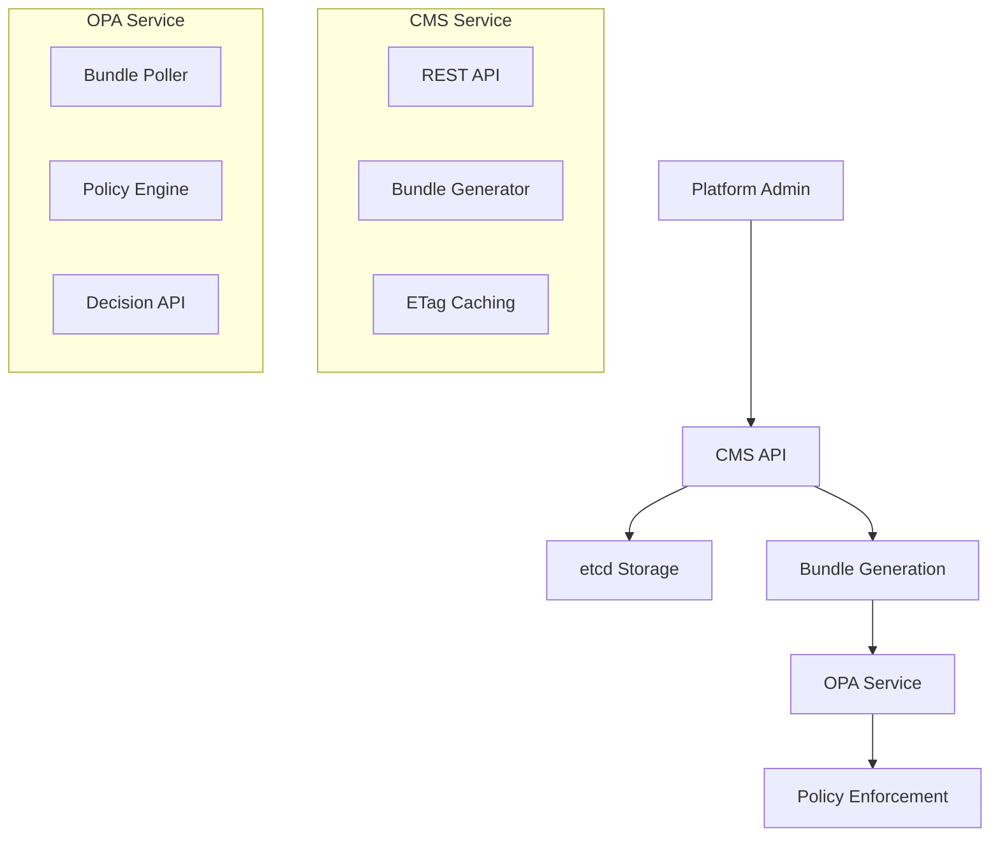
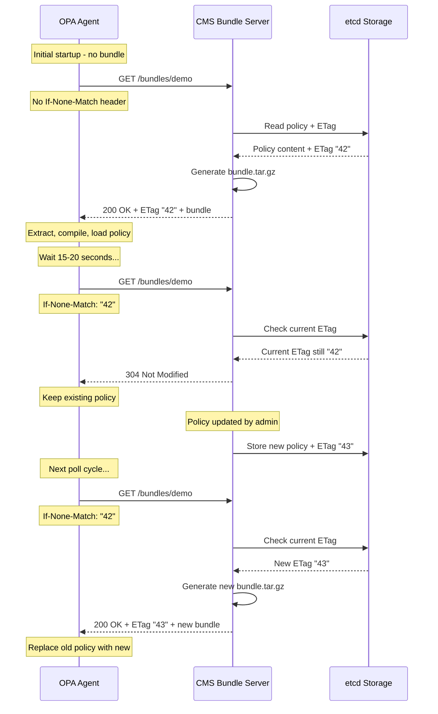

# CMS-OPA Bundle Architecture

A comprehensive Content Management System (CMS) for Open Policy Agent (OPA) policy distribution using bundle polling architecture.

## 🏗️ Architecture Overview

This system implements a complete policy management and distribution workflow:

```
Platform Admin → CMS API → etcd Storage → Bundle Generation → OPA Polling → Policy Enforcement
```

### Core Components

1. **CMS (Content Management Service)** - FastAPI-based policy management and bundle serving
2. **etcd** - Distributed key-value store for policy persistence  
3. **OPA (Open Policy Agent)** - Policy engine with bundle polling capabilities

### Architecture Diagram



## 🚀 Quick Start

### Prerequisites

- Docker & Docker Compose
- Python 3.8+ (for testing)
- curl (for API testing)

### Launch the System

```bash
# Clone and navigate to project
git clone <repository-url>
cd CMS

# Start all services
docker-compose up -d

# Verify services are running
docker-compose ps
```

### Service Endpoints

| Service     | Endpoint                      | Purpose                              |
| ----------- | ----------------------------- | ------------------------------------ |
| CMS API     | http://localhost:8080         | Policy management and bundle serving |
| CMS Docs    | http://localhost:8080/docs    | Interactive API documentation        |
| OPA API     | http://localhost:8181         | Policy evaluation and management     |
| OPA Metrics | http://localhost:8282/metrics | Prometheus metrics                   |
| etcd        | http://localhost:2379         | Key-value storage                    |

## 📋 Detailed Component Documentation

### 1. CMS (Content Management Service)

**Technology Stack:**
- FastAPI (Python web framework)
- Uvicorn (ASGI server)
- etcd3 client for storage

**Key Features:**
- RESTful API for policy CRUD operations
- Automatic OPA bundle generation (tar.gz format)
- ETag-based caching for efficient polling
- Health monitoring endpoints

**API Endpoints:**

#### Policy Management
```bash
# Create/Update Policy
PUT /policies/demo
Content-Type: application/json
{
    "rego": "package demo\n\ndefault allow = false\n\nallow if {\n    input.user.role == \"admin\"\n}",
    "data": {"users": {"alice": {"role": "admin"}}}
}

# Read Policy
GET /policies/demo

# Response Format
{
    "rego": "<policy-content>",
    "data": {"users": {...}},
    "etag": "42"
}
```

#### Bundle Distribution
```bash
# Get OPA Bundle (with ETag support)
GET /bundles/demo
If-None-Match: "41"

# Response: 200 OK (new bundle) or 304 Not Modified (cached)
Content-Type: application/gzip
ETag: "42"
<binary-tar-gz-data>
```

#### Health & Status
```bash
# Health Check
GET /health
# Response: {"status": "healthy"}

# API Documentation
GET /docs
# Interactive Swagger UI
```

**Bundle Structure:**
```
bundle.tar.gz
├── demo.rego          # OPA policy file
└── data.json          # Policy data (optional)
```

### 2. etcd Storage

**Configuration:**
- Port: 2379
- Authentication: Disabled (development)
- API Version: v3

**Data Structure:**
```
etcd key-value pairs:
├── policies/demo/rego    → Policy content
├── policies/demo/data    → Policy data
└── policies/demo/etag    → Version tracking
```

**Health Monitoring:**
```bash
# Check etcd health
docker exec cms-etcd-1 etcdctl endpoint health

# List all policies
docker exec cms-etcd-1 etcdctl get --prefix policies/
```

### 3. OPA (Open Policy Agent)

**Version:** 1.7.1 (latest with modern Rego syntax)

**Configuration** (`services/opa/config.yaml`):
```yaml
services:
  cms:
    url: http://cms:8080
    
bundles:
  demo:
    service: cms
    resource: /bundles/demo
    polling:
      min_delay_seconds: 15
      max_delay_seconds: 20
```

**Key Features:**
- Bundle polling every 15-20 seconds
- Automatic policy compilation and loading
- RESTful decision API
- Comprehensive metrics and status reporting

**Policy Syntax (OPA v1.7+):**
```rego
package demo

default allow = false

# Modern syntax requires 'if' keyword
allow if {
    input.user.role == "admin"
}

allow if {
    input.user.role == "user"
    input.user.id == input.resource.owner
}
```

## 🔄 Complete Workflow

### 1. Policy Creation/Update

```bash
# Step 1: Admin creates/updates policy via CMS
curl -X PUT http://localhost:8080/policies/demo \
  -H "Content-Type: application/json" \
  -d '{
    "rego": "package demo\n\ndefault allow = false\n\nallow if {\n    input.user.role == \"admin\"\n}",
    "data": {"users": {"alice": {"role": "admin"}}}
  }'

# Response: {"status": "updated", "etag": "43"}
```

### 2. Storage & Bundle Generation

```bash
# Step 2: CMS stores policy in etcd
# - Policy content stored with versioning
# - ETag incremented for cache invalidation
# - Bundle automatically generated on-demand

# Verify storage
docker exec cms-etcd-1 etcdctl get policies/demo/rego
```

### 3. OPA Bundle Polling

```bash
# Step 3: OPA polls for bundle updates (15-20 second intervals)
# - Sends If-None-Match header with current ETag
# - Downloads new bundle if ETag changed
# - Extracts and compiles policy
# - Updates policy engine

# Monitor OPA status
curl http://localhost:8181/v1/status | jq '.result.bundles.demo'
```

### 4. Policy Enforcement

```bash
# Step 4: Policy evaluation
curl -X POST http://localhost:8181/v1/data/demo/allow \
  -H "Content-Type: application/json" \
  -d '{
    "input": {
      "user": {"role": "admin", "id": "alice"},
      "resource": {"owner": "bob"}
    }
  }'

# Response: {"result": true, "decision_id": "uuid"}
```

## 🔄 OPA Bundle API Flow Deep Dive

This section provides a detailed technical explanation of the OPA Bundle API polling mechanism and HTTP flow.

### Bundle Polling Architecture



### Detailed HTTP Flow

#### 1. Initial Bundle Request (First Time)

**OPA Request:**
```http
GET /bundles/demo HTTP/1.1
Host: cms:8080
User-Agent: Open Policy Agent/1.7.1
Accept: application/gzip
Accept-Encoding: gzip
```

**CMS Processing:**
1. Check if bundle exists for policy "demo"
2. Read policy content from etcd: `policies/demo/rego`
3. Read policy data from etcd: `policies/demo/data` (optional)
4. Read current ETag from etcd: `policies/demo/etag`
5. Generate tar.gz bundle containing:
   - `demo.rego` (policy file)
   - `data.json` (data file, if present)

**CMS Response:**
```http
HTTP/1.1 200 OK
Content-Type: application/gzip
Content-Length: 1247
ETag: "42"
Cache-Control: max-age=0

<binary-tar-gz-content>
```

**Bundle Content Structure:**
```bash
$ tar -tzf bundle.tar.gz
demo.rego
data.json
```

#### 2. Subsequent Bundle Requests (Polling)

**OPA Request with ETag:**
```http
GET /bundles/demo HTTP/1.1
Host: cms:8080
User-Agent: Open Policy Agent/1.7.1
Accept: application/gzip
Accept-Encoding: gzip
If-None-Match: "42"
```

**CMS Processing:**
1. Extract ETag from `If-None-Match` header: "42"
2. Read current ETag from etcd: `policies/demo/etag`
3. Compare ETags:
   - **Same ETag**: Return 304 Not Modified
   - **Different ETag**: Generate and return new bundle

**CMS Response (No Changes):**
```http
HTTP/1.1 304 Not Modified
ETag: "42"
Cache-Control: max-age=0
```

**CMS Response (Policy Updated):**
```http
HTTP/1.1 200 OK
Content-Type: application/gzip
Content-Length: 1289
ETag: "43"
Cache-Control: max-age=0

<new-binary-tar-gz-content>
```

#### 3. Policy Update Trigger Flow

**Admin Updates Policy:**
```bash
curl -X PUT http://localhost:8080/policies/demo \
  -H "Content-Type: application/json" \
  -d '{
    "rego": "package demo\n\ndefault allow = false\n\nallow if {\n    input.user.role == \"admin\"\n}\n\nallow if {\n    input.user.role == \"manager\"\n    input.action == \"read\"\n}",
    "data": {"users": {"alice": {"role": "admin"}, "bob": {"role": "manager"}}}
  }'
```

**CMS Internal Processing:**
1. Validate policy syntax and JSON structure
2. Store policy content: `etcd.put("policies/demo/rego", policy_content)`
3. Store policy data: `etcd.put("policies/demo/data", json.dumps(data))`
4. Increment ETag: `etcd.put("policies/demo/etag", str(current_etag + 1))`
5. Invalidate any cached bundles

**Next OPA Poll:**
```bash
# OPA automatically detects ETag mismatch and downloads new bundle
# Policy engine recompiles and loads updated rules
```

### OPA Bundle Configuration

**OPA Config (`services/opa/config.yaml`):**
```yaml
services:
  cms:
    url: http://cms:8080
    
bundles:
  demo:                           # Bundle name
    service: cms                  # References service above
    resource: /bundles/demo       # Bundle endpoint path
    polling:
      min_delay_seconds: 15       # Minimum poll interval
      max_delay_seconds: 20       # Maximum poll interval (with jitter)
    persist: true                 # Cache bundles to disk
    
decision_logs:
  console: true                   # Enable decision logging
```

### Bundle Lifecycle States

#### 1. Bundle Loading States

**Monitor bundle status:**
```bash
curl http://localhost:8181/v1/status | jq '.result.bundles.demo'
```

**Possible States:**

```json
{
  "name": "demo",
  "active_revision": "42",
  "last_successful_activation": "2025-09-09T23:39:07.123456Z",
  "last_successful_download": "2025-09-09T23:39:07.089012Z",
  "last_successful_request": "2025-09-09T23:39:07.067890Z",
  "message": "",
  "code": "ok",
  "type": "bundle"
}
```

**Error States:**
```json
{
  "name": "demo",
  "message": "bundle compilation failed: rego syntax error",
  "code": "bundle_error",
  "errors": [
    {
      "message": "expected 'if' keyword",
      "location": {"row": 5, "col": 8}
    }
  ]
}
```

#### 2. Policy Compilation Process

**When OPA receives a bundle:**

1. **Extract Bundle:** Unpack tar.gz to temporary directory
2. **Parse Rego Files:** Compile `.rego` files into Abstract Syntax Tree (AST)
3. **Load Data:** Import any `data.json` files into OPA data store
4. **Validate Syntax:** Ensure all policies compile without errors
5. **Activate Bundle:** Replace previous policy set with new policies
6. **Update Status:** Mark bundle as active with new revision

**Policy Loading Verification:**
```bash
# Check loaded policies
curl http://localhost:8181/v1/policies | jq '.result[] | {id: .id, size: (.raw | length)}'

# Expected output:
{
  "id": "demo/demo.rego",
  "size": 234
}

# Verify policy content
curl http://localhost:8181/v1/policies/demo/demo.rego | jq '.result.raw'
```

### Error Handling & Recovery

#### Bundle Download Failures

**Network Issues:**
```bash
# OPA logs will show:
# bundle download failed: context deadline exceeded
```

**Recovery:** OPA continues using last successful bundle and retries on next poll cycle

#### Policy Compilation Errors

**Syntax Errors:**
```bash
# OPA status shows:
curl http://localhost:8181/v1/status | jq '.result.bundles.demo.errors'

# Example error:
[
  {
    "message": "rego_parse_error: expected 'if' keyword",
    "location": {"file": "demo.rego", "row": 5, "col": 8}
  }
]
```

**Recovery:** OPA keeps previous working policy active

#### Cache Corruption Recovery

**Manual Bundle Reload:**
```bash
# Force bundle reload (bypasses cache)
curl -X POST http://localhost:8181/v1/bundles/demo \
  -H "Content-Type: application/gzip" \
  --data-binary @bundle.tar.gz
```

### Performance Optimization

#### Bundle Size Management

**Large Policy Sets:**
- Compress bundle content (gzip is automatic)
- Split large policies into multiple smaller files
- Use data references instead of embedding large datasets

**ETag Efficiency:**
- ETags prevent unnecessary downloads
- Bandwidth usage reduced by ~90% for unchanged policies
- CPU usage minimized with cache hits

#### Polling Optimization

**Adaptive Polling:**
```yaml
# More frequent polling for critical policies
bundles:
  critical:
    polling:
      min_delay_seconds: 5
      max_delay_seconds: 10

# Less frequent for stable policies  
  stable:
    polling:
      min_delay_seconds: 60
      max_delay_seconds: 120
```

### Monitoring Bundle Operations

**Key Metrics to Track:**

```bash
# Bundle request frequency
curl http://localhost:8282/metrics | grep bundle_request

# Bundle download success rate  
curl http://localhost:8282/metrics | grep bundle_download

# Policy compilation time
curl http://localhost:8282/metrics | grep bundle_loading_duration

# ETag cache hit rate
curl http://localhost:8282/metrics | grep http_request_duration
```

**Health Check Script:**
```bash
#!/bin/bash
# bundle_health_check.sh

BUNDLE_STATUS=$(curl -s http://localhost:8181/v1/status | jq -r '.result.bundles.demo.code')

if [ "$BUNDLE_STATUS" = "ok" ]; then
    echo "✅ Bundle status: Healthy"
    LAST_UPDATE=$(curl -s http://localhost:8181/v1/status | jq -r '.result.bundles.demo.last_successful_activation')
    echo "📅 Last update: $LAST_UPDATE"
else
    echo "❌ Bundle status: $BUNDLE_STATUS"
    curl -s http://localhost:8181/v1/status | jq '.result.bundles.demo.errors'
fi
```

This deep dive covers the complete OPA Bundle API flow from HTTP requests to policy loading, error handling, and performance optimization strategies.

## 🧪 Comprehensive Testing Suite

### Integration Test Architecture

The integration test suite (`tests/integration_test.py`) provides comprehensive validation of the entire system:

```python
class IntegrationTestSuite:
    """
    Comprehensive test coverage:
    1. Service Health Checks
    2. Policy CRUD Operations
    3. Bundle Generation & ETag Caching
    4. OPA Bundle Polling & Policy Loading
    5. Policy Decision Validation
    6. End-to-End Workflow Testing
    """
```

### Test Categories

#### 1. Service Health Validation
```python
def test_service_health(self):
    """Validates all services are operational"""
    # ✓ CMS health endpoint
    # ✓ OPA health endpoint  
    # ✓ OPA bundle system status
    # ✓ etcd connectivity (implicit)
```

#### 2. Policy CRUD Operations
```python
def test_policy_crud_operations(self):
    """Tests policy management lifecycle"""
    # ✓ CREATE: PUT /policies/demo
    # ✓ READ: GET /policies/demo
    # ✓ UPDATE: PUT /policies/demo (modification)
    # ✓ Data validation and persistence
```

#### 3. Bundle Generation & Caching
```python
def test_bundle_generation(self):
    """Validates bundle creation and content"""
    # ✓ Bundle download (GET /bundles/demo)
    # ✓ Content-Type validation (application/gzip)
    # ✓ Tar.gz structure validation
    # ✓ Policy content verification

def test_bundle_etag_caching(self):
    """Tests ETag-based caching mechanism"""
    # ✓ Initial bundle request with ETag
    # ✓ Cached request (304 Not Modified)
    # ✓ Cache invalidation after policy change
    # ✓ New ETag generation
```

#### 4. OPA Integration Testing
```python
def test_opa_bundle_polling(self):
    """Validates OPA bundle polling workflow"""
    # ✓ Bundle status monitoring
    # ✓ Policy loading verification
    # ✓ Compilation success validation
    # ✓ Policy availability confirmation

def test_policy_decisions(self):
    """Tests policy evaluation scenarios"""
    # ✓ Admin access (should allow)
    # ✓ User access to own resources (should allow)
    # ✓ User access to others' resources (should deny)
    # ✓ Decision API response validation
```

#### 5. End-to-End Workflow
```python
def test_end_to_end_workflow(self):
    """Complete workflow validation"""
    # ✓ Complex policy creation with multiple rules
    # ✓ Data structure integration
    # ✓ Multiple user roles and scenarios
    # ✓ Real-world authorization patterns
```

### Running Tests

```bash
# Run complete integration test suite
python tests/integration_test.py

# Expected output:
# ================================================================================
# CMS-OPA Bundle Architecture Integration Test Suite  
# ================================================================================
# 2025-09-09 23:38:47,498 - INFO - ✓ CMS service is healthy
# 2025-09-09 23:38:47,519 - INFO - ✓ OPA service is healthy
# 2025-09-09 23:38:47,546 - INFO - ✓ Policy created successfully
# 2025-09-09 23:38:47,566 - INFO - ✓ Policy updated successfully
# 2025-09-09 23:38:47,575 - INFO - ✓ Bundle generated with correct content type
# 2025-09-09 23:38:47,596 - INFO - ✓ ETag caching working correctly
# 2025-09-09 23:38:47,620 - INFO - Waiting for OPA to poll bundle...
# 2025-09-09 23:39:07,645 - INFO - ✓ Test policy loaded in OPA
# 2025-09-09 23:39:07,678 - INFO - ✓ Admin access correctly allowed
# 2025-09-09 23:39:07,695 - INFO - ✓ User access correctly allowed
# 2025-09-09 23:39:07,712 - INFO - ✓ Unauthorized access correctly denied
# 2025-09-09 23:39:07,890 - INFO - ✓ ALL TESTS PASSED! Integration is working correctly.
```

### Quick Debug Testing

```bash
# Quick system status check
python debug_integration.py

# Manual policy testing
curl -X POST http://localhost:8181/v1/data/demo/allow \
  -H "Content-Type: application/json" \
  -d '{
    "input": {
      "user": {"role": "admin", "id": "alice"},
      "resource": {"owner": "bob"}
    }
  }'
```

## 🔧 Configuration Files

### Policy Configuration Examples

#### Basic Authorization Policy
```json
{
    "rego": "package demo\n\ndefault allow = false\n\nallow if {\n    input.user.role == \"admin\"\n}\n\nallow if {\n    input.user.role == \"user\"\n    input.user.id == input.resource.owner\n}",
    "data": {
        "users": {
            "alice": {"role": "admin"},
            "bob": {"role": "user"}
        }
    }
}
```

#### Advanced Role-Based Access Control
```json
{
    "rego": "package demo\n\ndefault allow = false\n\nallow if {\n    input.user.role == \"admin\"\n}\n\nallow if {\n    input.user.role == \"manager\"\n    input.user.team == input.resource.team\n}\n\nallow if {\n    input.user.role == \"user\"\n    input.user.id == input.resource.owner\n}",
    "data": {
        "teams": {
            "engineering": {"members": ["alice", "bob"]},
            "marketing": {"members": ["charlie", "diana"]}
        },
        "users": {
            "alice": {"role": "manager", "team": "engineering"},
            "bob": {"role": "user", "team": "engineering"},
            "charlie": {"role": "admin", "team": "marketing"},
            "diana": {"role": "user", "team": "marketing"}
        }
    }
}
```

### Docker Compose Configuration

```yaml
# docker-compose.yml
version: "3.9"

services:
  etcd:
    build:
      context: ./services/etcd
      dockerfile: Dockerfile
    environment:
      - ALLOW_NONE_AUTHENTICATION=yes
      - ETCD_ENABLE_V2=false
      - ETCD_ADVERTISE_CLIENT_URLS=http://etcd:2379
      - ETCD_LISTEN_CLIENT_URLS=http://0.0.0.0:2379
    ports:
      - "2379:2379"
    healthcheck:
      test: [ "CMD", "/opt/bitnami/etcd/bin/etcdctl", "endpoint", "health" ]
      interval: 5s
      timeout: 3s
      retries: 20

  opa:
    build:
      context: ./services/opa
      dockerfile: Dockerfile
    ports:
      - "8181:8181"  # Policy API
      - "8282:8282"  # Metrics

  cms:
    build:
      context: ./services/cms
      dockerfile: Dockerfile
    environment:
      - ETCD_HOST=etcd
      - ETCD_PORT=2379
    depends_on:
      etcd:
        condition: service_healthy
    ports:
      - "8080:8080"

networks:
  default:
    name: cms-net
```

## 🚨 Troubleshooting Guide

### Common Issues & Solutions

#### 1. OPA Policy Loading Issues

**Symptom:** Policy appears truncated or contains only default rules
```bash
# Check current policy
curl http://localhost:8181/v1/policies
# Shows: "raw": "package demo\ndefault allow = false"
```

**Root Cause:** Rego syntax incompatibility (missing `if` keywords)

**Solution:** Update policy syntax for OPA v1.7+
```rego
# ❌ Old syntax (broken)
allow {
    input.user.role == "admin"
}

# ✅ New syntax (working)
allow if {
    input.user.role == "admin"
}
```

#### 2. Bundle Polling Failures

**Symptom:** OPA not updating policies after changes
```bash
# Check OPA bundle status
curl http://localhost:8181/v1/status | jq '.result.bundles.demo'
# Shows: "last_successful_activation": "0001-01-01T00:00:00Z"
```

**Root Cause:** Bundle compilation errors or network issues

**Diagnosis Steps:**
```bash
# 1. Check OPA logs
docker-compose logs opa --tail 20

# 2. Verify bundle content
curl -s http://localhost:8080/bundles/demo -o test.tar.gz
tar -tf test.tar.gz
tar -xzf test.tar.gz demo.rego && cat demo.rego

# 3. Test bundle manually
curl -X POST http://localhost:8181/v1/bundles/demo \
  -H "Content-Type: application/gzip" \
  --data-binary @test.tar.gz
```

**Solutions:**
- Fix Rego syntax errors
- Verify network connectivity between OPA and CMS
- Check OPA configuration (`services/opa/config.yaml`)
- Restart OPA service: `docker-compose restart opa`

#### 3. ETag Caching Problems

**Symptom:** Bundle not updating despite policy changes

**Diagnosis:**
```bash
# Check ETag progression
curl -I http://localhost:8080/bundles/demo
# Should show: ETag: "43"

# After policy update
curl -X PUT http://localhost:8080/policies/demo -d '...'
curl -I http://localhost:8080/bundles/demo  
# Should show: ETag: "44"
```

**Solutions:**
- Verify policy update was successful
- Check etcd storage consistency
- Restart CMS service if ETag stuck

#### 4. Service Connectivity Issues

**Symptom:** Services cannot communicate

**Diagnosis:**
```bash
# Check service status
docker-compose ps

# Test internal networking
docker exec cms-cms-1 curl http://etcd:2379/health
docker exec cms-opa-1 curl http://cms:8080/health
```

**Solutions:**
- Verify all services are running
- Check Docker network configuration
- Restart entire stack: `docker-compose down && docker-compose up -d`

#### 5. Policy Decision Errors

**Symptom:** Unexpected policy evaluation results

**Diagnosis:**
```bash
# Test specific scenarios
curl -X POST http://localhost:8181/v1/data/demo/allow \
  -H "Content-Type: application/json" \
  -d '{
    "input": {
      "user": {"role": "admin", "id": "alice"},
      "resource": {"owner": "bob"}
    }
  }'

# Check policy compilation
curl http://localhost:8181/v1/policies | jq '.result[0].ast'
```

**Solutions:**
- Verify policy logic and syntax
- Test with simplified input data
- Check for typos in field names
- Validate JSON structure

### Debugging Commands

```bash
# Service health overview
docker-compose ps
curl http://localhost:8080/health
curl http://localhost:8181/health

# Policy status check
curl http://localhost:8181/v1/policies | jq '.result[] | {id: .id, size: (.raw | length)}'

# Bundle validation
curl -s http://localhost:8080/bundles/demo | tar -tz

# etcd data inspection  
docker exec cms-etcd-1 etcdctl get --prefix policies/ --print-value-only

# OPA status monitoring
curl http://localhost:8181/v1/status | jq '.result.bundles'

# Complete integration test
python tests/integration_test.py

# Quick system validation
python debug_integration.py
```

## 📊 Monitoring & Metrics

### OPA Metrics

OPA exposes Prometheus metrics on port 8282:

```bash
# Access metrics
curl http://localhost:8282/metrics

# Key metrics to monitor:
# - bundle_loaded_counter
# - bundle_request_duration_seconds  
# - policy_evaluation_duration_seconds
# - http_request_duration_seconds
```

### CMS Monitoring

Built-in health checks and logging:

```bash
# Health endpoint
curl http://localhost:8080/health

# View logs
docker-compose logs cms --tail 50

# Monitor bundle requests
docker-compose logs cms | grep "bundle"
```

### System Status Dashboard

Create a simple monitoring script:

```bash
#!/bin/bash
# system_status.sh

echo "=== CMS-OPA System Status ==="
echo "CMS Health: $(curl -s http://localhost:8080/health | jq -r '.status // "ERROR"')"
echo "OPA Health: $(curl -s http://localhost:8181/health || echo "ERROR")"

POLICIES=$(curl -s http://localhost:8181/v1/policies | jq '.result | length')
echo "Loaded Policies: $POLICIES"

BUNDLE_STATUS=$(curl -s http://localhost:8181/v1/status | jq -r '.result.bundles.demo.message // "Unknown"')
echo "Bundle Status: $BUNDLE_STATUS"

echo "Last Bundle Update: $(curl -s http://localhost:8181/v1/status | jq -r '.result.bundles.demo.last_successful_activation // "Never"')"
```

## 🔐 Security Considerations

### Production Deployment

1. **Enable etcd Authentication**
```yaml
# etcd security configuration
environment:
  - ETCD_ROOT_PASSWORD=<secure-password>
  - ETCD_AUTH_TOKEN=simple
```

2. **TLS Encryption**
```yaml
# Add TLS certificates
volumes:
  - ./certs:/certs:ro
environment:
  - ETCD_CERT_FILE=/certs/etcd.crt
  - ETCD_KEY_FILE=/certs/etcd.key
```

3. **API Authentication**
```python
# Add authentication middleware to CMS
from fastapi.security import HTTPBearer
security = HTTPBearer()
```

4. **Network Security**
```yaml
# Restrict external access
networks:
  internal:
    driver: bridge
    internal: true
```

### Policy Security

1. **Input Validation**
```rego
# Validate input structure
allow if {
    is_valid_user(input.user)
    is_valid_resource(input.resource)
    # ... authorization logic
}

is_valid_user(user) if {
    is_string(user.role)
    is_string(user.id)
}
```

2. **Principle of Least Privilege**
```rego
# Default deny, explicit allow
default allow = false

# Minimal necessary permissions
allow if {
    input.user.role == "admin"
    input.action in ["read", "write"]
    input.resource.type == "document"
}
```

## 📚 Additional Resources

### OPA Documentation
- [OPA Official Documentation](https://www.openpolicyagent.org/docs/)
- [Rego Language Reference](https://www.openpolicyagent.org/docs/latest/policy-language/)
- [Bundle API Specification](https://www.openpolicyagent.org/docs/latest/management-bundles/)

### FastAPI Resources
- [FastAPI Documentation](https://fastapi.tiangolo.com/)
- [Uvicorn ASGI Server](https://www.uvicorn.org/)

### etcd Resources  
- [etcd Documentation](https://etcd.io/docs/)
- [etcd API Reference](https://etcd.io/docs/v3.5/dev-guide/api_reference_v3/)

### Testing Resources
- [Python Requests Library](https://requests.readthedocs.io/)
- [Docker Compose Reference](https://docs.docker.com/compose/)

## 🤝 Contributing

### Development Setup

1. **Clone Repository**
```bash
git clone <repository-url>
cd CMS
```

2. **Start Development Environment**
```bash
docker-compose up -d
```

3. **Run Tests**
```bash
python tests/integration_test.py
```

4. **Code Style**
- Follow PEP 8 for Python code
- Use proper Rego formatting for policies
- Add comprehensive docstrings

### Project Structure

```
CMS/
├── services/
│   ├── cms/               # FastAPI service
│   │   ├── app/
│   │   ├── Dockerfile
│   │   └── requirements.txt
│   ├── opa/               # OPA configuration
│   │   ├── config.yaml
│   │   └── Dockerfile
│   └── etcd/              # etcd configuration
│       └── Dockerfile
├── tests/
│   ├── integration_test.py
│   └── debug_integration.py
├── docker-compose.yml
├── README.md
├── corrected_policy.json
├── updated_policy.json
└── POLICY_CONFIG_DOCS.md
```

---

## 📋 Summary

This CMS-OPA Bundle Architecture provides a production-ready solution for distributed policy management with the following key capabilities:

✅ **Scalable Policy Distribution** - Bundle-based polling architecture  
✅ **Real-time Updates** - 15-20 second policy propagation  
✅ **Efficient Caching** - ETag-based bundle caching  
✅ **Comprehensive Testing** - Full integration test suite  
✅ **Production Ready** - Health monitoring, metrics, logging  
✅ **Developer Friendly** - API documentation, debugging tools  

The system successfully implements the complete workflow from policy creation to enforcement, with robust error handling and monitoring capabilities.

**System Status: 🟢 FULLY OPERATIONAL**

For questions or issues, refer to the troubleshooting guide or run the integration test suite to validate system health.
