# Configuration Management System (CMS) Architecture

## Overview

This document outlines the architecture for a production-grade, highly scalable Configuration Management System designed to manage OPA policies and API keys for a RAG-based platform using microservices architecture with FastAPI on Linux.

## System Requirements

### Users & Access Levels
1. **CMS Admin**: Full access to Configuration Management System
2. **Platform Admin**: Full access to RAG platform with project-level and platform-level policy management
3. **Project Users**: Read-only access to their specific project policies
4. **Multiple Projects**: Support for onboarding multiple project teams

### Core Features
- Secure storage of OPA policies and API keys
- Project team onboarding capabilities
- Policy modification workflows
- Active-active configuration support
- Stateless design for easy migration to Kubernetes
- Integration with APISIX API Gateway and AI Gateway

## High-Level Architecture

The system architecture is designed for high availability, scalability, and security. To make it easier to understand, we've broken down the single complex diagram into several focused views.

### 1. Overall Request Flow

This diagram shows the path of a typical request from an external user or service into the system's application layer.

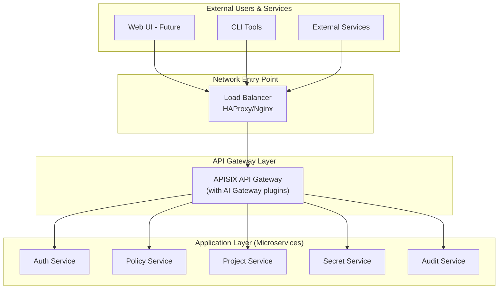

### 2. Datacenter Internal Architecture

This diagram shows the components within a single datacenter, illustrating how the microservices interact with the data layer. Both datacenters (DC1 and DC2) follow this same structure.

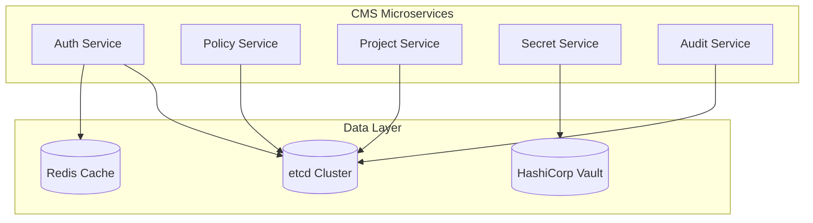

### 3. Cross-Datacenter Replication

For high availability and disaster recovery, the data layer is replicated across both datacenters.

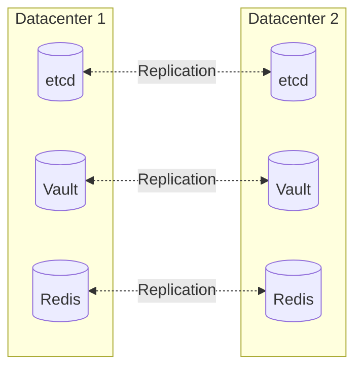

### 4. External Dependencies & Observability

This diagram shows how the CMS interacts with external storage and the monitoring stack.

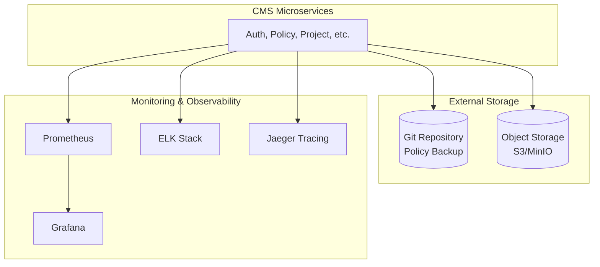

## Microservices Architecture

### Core Services

#### 1. Authentication & Authorization Service
- **Purpose**: Handle user authentication, JWT token management, RBAC
- **Technology**: FastAPI, JWT, OAuth2
- **Database**: Redis (sessions), etcd (user roles)
- **Features**:
  - Multi-tenant authentication
  - Role-based access control (CMS Admin, Platform Admin, Project User)
  - JWT token validation and refresh
  - Rate limiting

#### 2. Policy Management Service
- **Purpose**: Manage OPA policies (CRUD operations)
- **Technology**: FastAPI, OPA integration
- **Storage**: etcd (primary), Git (backup/versioning)
- **Features**:
  - Policy validation and testing
  - Version control integration
  - Policy deployment workflows
  - Rollback capabilities

#### 3. Project Management Service
- **Purpose**: Handle project onboarding and team management
- **Technology**: FastAPI
- **Storage**: etcd
- **Features**:
  - Project creation and configuration
  - Team member management
  - Project-level policy assignment
  - Multi-tenancy support

#### 4. Secret Management Service
- **Purpose**: Secure storage and retrieval of API keys
- **Technology**: FastAPI, HashiCorp Vault
- **Storage**: Vault (encrypted), etcd (metadata)
- **Features**:
  - Encrypted secret storage
  - Key rotation capabilities
  - Audit logging
  - Access policies

#### 5. Audit & Logging Service
- **Purpose**: Track all system activities and changes
- **Technology**: FastAPI, ELK Stack
- **Storage**: etcd, Elasticsearch
- **Features**:
  - Comprehensive audit trails
  - Policy change tracking
  - Access logging
  - Compliance reporting

## Data Architecture

### Primary Storage Strategy

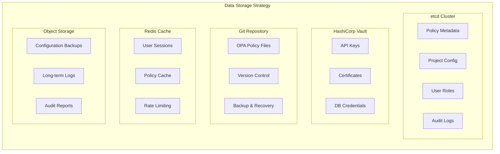

### Data Flow & Consistency

1. **etcd**: Primary storage for configuration metadata, project settings, and user roles
2. **Git**: Version-controlled storage for OPA policies with full history
3. **Vault**: Encrypted storage for sensitive data (API keys, certificates)
4. **Redis**: Caching layer for performance and session management
5. **Object Storage**: Long-term backup and archival

## Security Architecture

### Multi-Layer Security

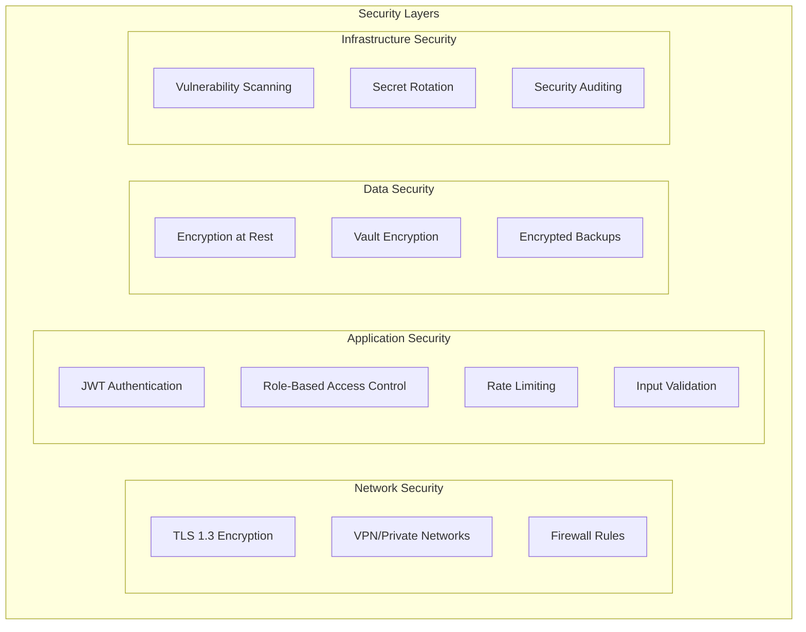

## Workflow Diagrams

### 1. Policy Management Workflow

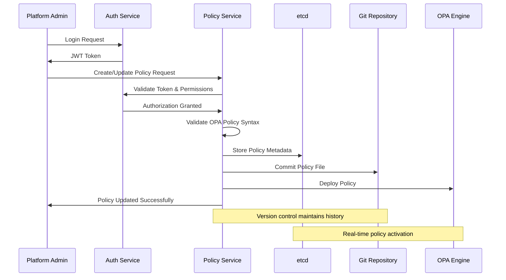

### 2. Project Onboarding Workflow

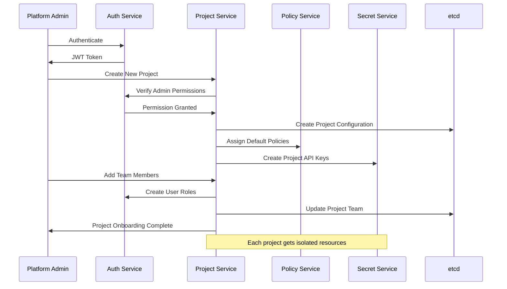

### 3. API Key Management Workflow

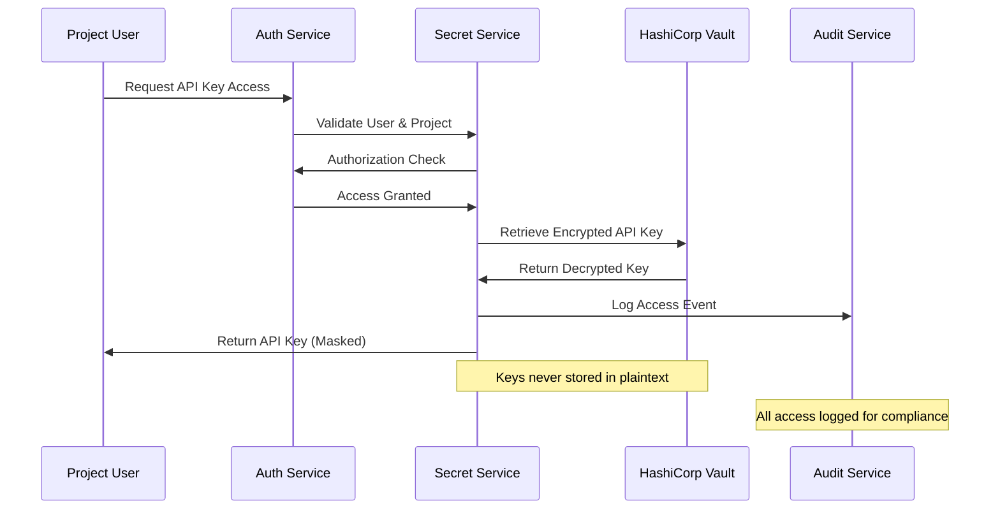

### 4. Policy Request & Approval Workflow

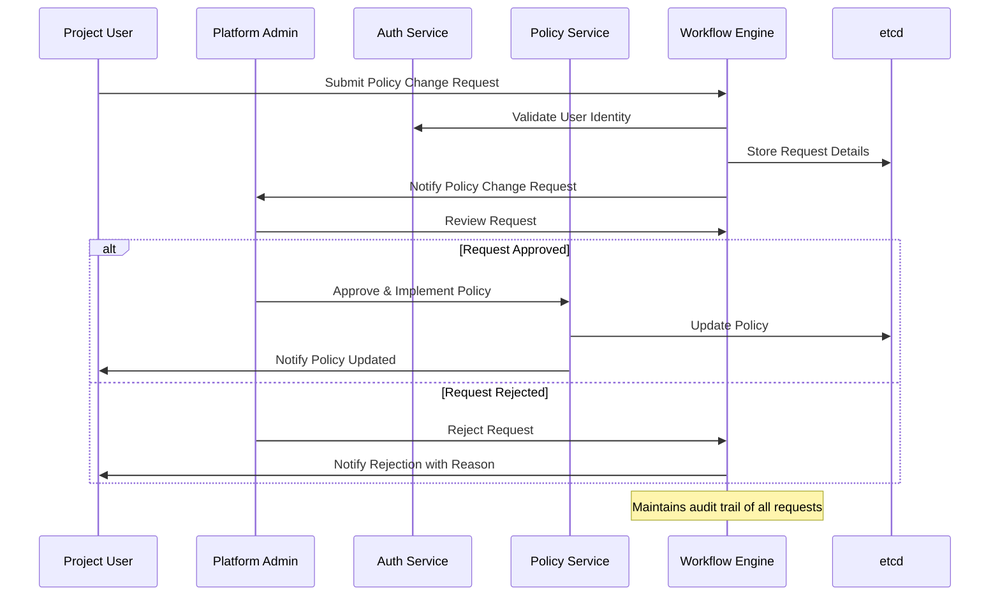

## Deployment Architecture

### Multi-Datacenter Setup

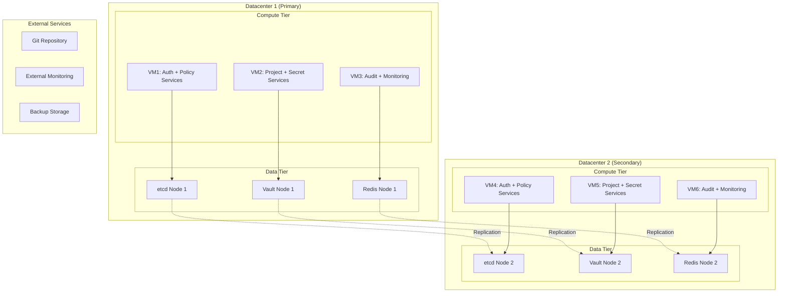

## Technology Stack

### Core Technologies
- **Framework**: FastAPI (Python)
- **Authentication**: OAuth2 + JWT
- **API Gateway**: APISIX + AI Gateway
- **Container**: Docker (future Kubernetes migration)
- **Service Discovery**: etcd
- **Load Balancing**: HAProxy/Nginx

### Data Storage
- **Primary Config Store**: etcd cluster
- **Secret Management**: HashiCorp Vault
- **Version Control**: Git (GitLab/GitHub)
- **Caching**: Redis
- **Long-term Storage**: MinIO/S3

### Monitoring & Observability
- **Metrics**: Prometheus + Grafana
- **Logging**: ELK Stack (Elasticsearch, Logstash, Kibana)
- **Tracing**: Jaeger
- **Health Checks**: Custom FastAPI endpoints

### Security
- **Encryption**: TLS 1.3, AES-256
- **Secret Rotation**: Vault automatic rotation
- **Vulnerability Scanning**: Trivy/Anchore
- **Compliance**: SOC2, ISO 27001 ready

## Scalability Considerations

### Horizontal Scaling
- **Stateless Services**: All microservices designed stateless
- **Database Clustering**: etcd and Vault in cluster mode
- **Cache Distribution**: Redis Cluster for high availability
- **Load Distribution**: APISIX for intelligent routing

### Performance Optimization
- **Caching Strategy**: Multi-level caching (Redis, Application-level)
- **Connection Pooling**: Database connection optimization
- **Async Processing**: FastAPI async capabilities
- **Content Delivery**: CDN for static content

## Migration Strategy (VM to Kubernetes)

### Phase 1: VM Deployment (Current)
- Docker containers on VMs
- Manual orchestration
- File-based configuration

### Phase 2: Kubernetes Migration (Future)
- **Containerization**: All services containerized
- **Service Mesh**: Istio for advanced networking
- **Config Management**: Kubernetes ConfigMaps/Secrets
- **Auto-scaling**: HPA (Horizontal Pod Autoscaler)

### Migration Readiness
- Stateless design enables seamless migration
- Configuration externalization
- Health check endpoints for Kubernetes probes
- Graceful shutdown handling

## API Design Principles

### RESTful API Structure
```
/api/v1/auth/         # Authentication endpoints
/api/v1/policies/     # Policy management
/api/v1/projects/     # Project management
/api/v1/secrets/      # Secret management
/api/v1/audit/        # Audit and logging
/api/v1/health/       # Health checks
```

### API Standards
- **Versioning**: URL-based versioning (/api/v1/)
- **Authentication**: Bearer token (JWT)
- **Error Handling**: Standardized error responses
- **Rate Limiting**: Per-user and per-service limits
- **Documentation**: OpenAPI/Swagger integration

## Security Best Practices

### Access Control
- **Principle of Least Privilege**: Minimal required permissions
- **Multi-Factor Authentication**: Required for admin access
- **Session Management**: Secure session handling
- **API Rate Limiting**: Prevent abuse and DoS

### Data Protection
- **Encryption**: All data encrypted in transit and at rest
- **Key Management**: Automated key rotation
- **Backup Security**: Encrypted backups with retention policies
- **Audit Logging**: Comprehensive activity logging

## Monitoring & Alerting

### Key Metrics
- **Service Health**: Uptime, response times, error rates
- **Resource Usage**: CPU, memory, storage utilization
- **Security Events**: Authentication failures, unauthorized access
- **Business Metrics**: Policy changes, user activity

### Alert Categories
- **Critical**: Service outages, security breaches
- **Warning**: High resource usage, slow responses
- **Info**: Normal operational events

## Disaster Recovery

### Backup Strategy
- **Automated Backups**: Daily incremental, weekly full
- **Cross-Datacenter Replication**: Real-time data sync
- **Point-in-Time Recovery**: Policy and configuration rollback
- **Disaster Recovery Testing**: Regular DR drills

### Recovery Objectives
- **RTO (Recovery Time Objective)**: < 30 minutes
- **RPO (Recovery Point Objective)**: < 5 minutes
- **Data Integrity**: Zero data loss tolerance

## Conclusion

This architecture provides a robust, scalable, and secure foundation for the Configuration Management System. The design emphasizes:

1. **Scalability**: Horizontal scaling capabilities
2. **Security**: Multi-layer security approach
3. **Reliability**: High availability across datacenters
4. **Maintainability**: Modular microservices design
5. **Future-Proof**: Easy migration to Kubernetes

The stateless design and containerization strategy ensure smooth transition from VM-based deployment to Kubernetes orchestration, providing flexibility for future infrastructure evolution.
