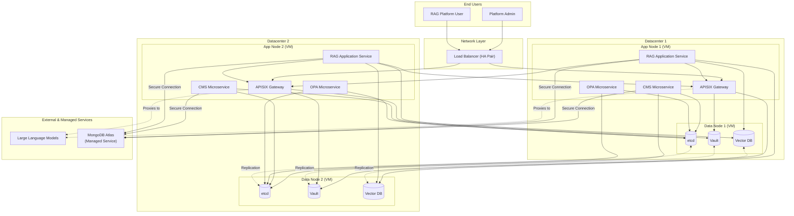
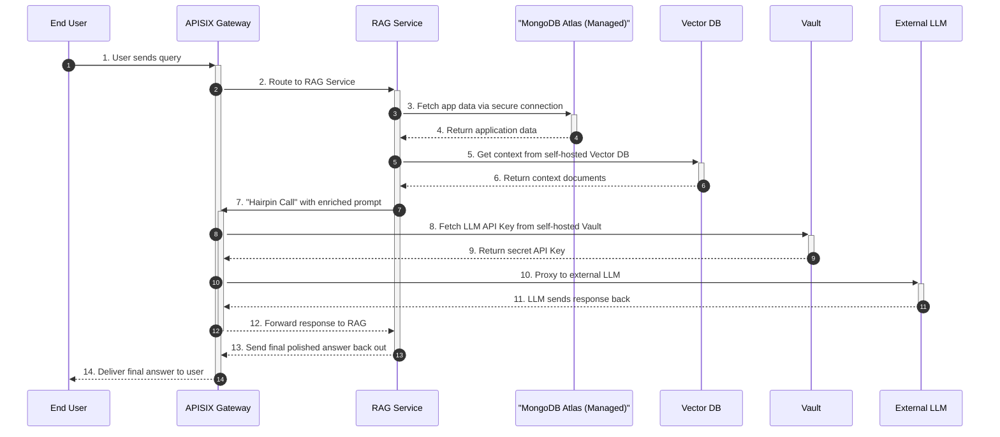
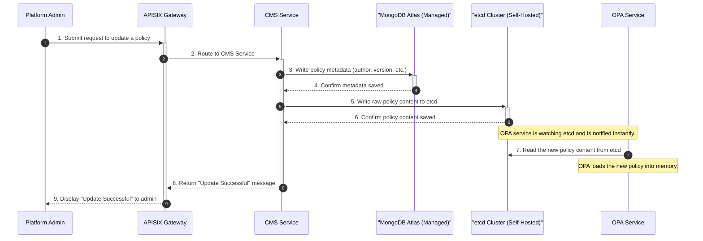

# Final Architecture with Multi-Datacenter HA

This document provides the definitive, comprehensive view of the system architecture. It shows the high-availability setup across two datacenters, the use of a managed MongoDB service, and includes detailed workflow diagrams.

## 1. High-Availability Architecture Diagram

This diagram shows the complete architecture deployed across two datacenters for high availability and disaster recovery.

## 2. Component Descriptions & Rationale

-   **etcd:** Used for live configuration and OPA policies that require instant propagation via its `watch` feature.
-   **MongoDB (Managed):** Used for all general application data (user profiles, document metadata, etc.). A managed service is used to reduce operational overhead.
-   **HashiCorp Vault:** A dedicated secrets management tool for all API keys and credentials.
-   **Vector Database:** A specialized database for storing and querying vector embeddings.

---

## 3. Detailed Workflow Sequence Diagrams

### End-to-End RAG Query Flow

### CMS Policy Update Flow

