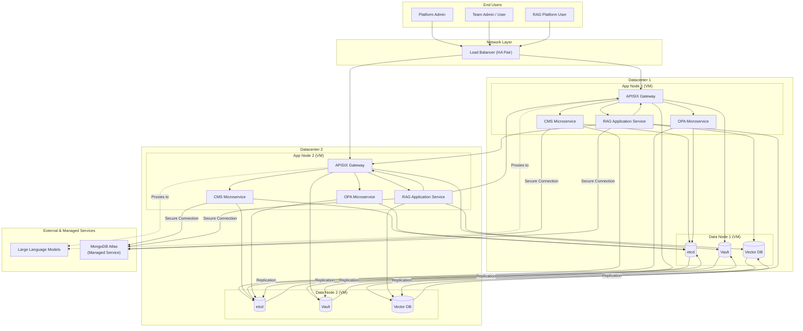
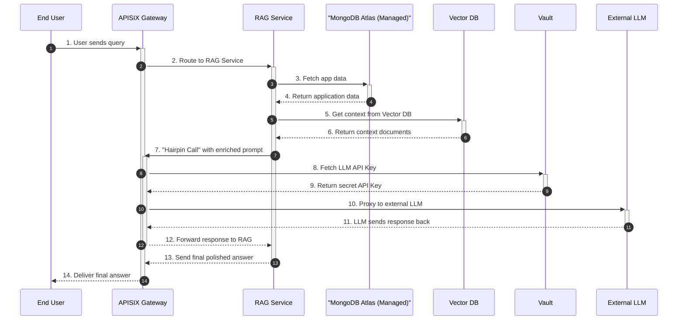
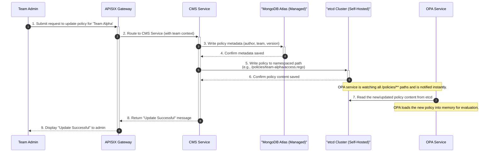

# Final Architecture with Corrected Request Flow

This document provides the definitive, comprehensive view of the system architecture. It details the multi-datacenter HA setup, the multi-tenant policy model, and the correct internal request flow.

## 1. High-Availability Architecture Diagram

This diagram shows the complete architecture, including the correct request routing from the APISIX gateway to the backend services. This version is also safe to import into `diagrams.net`.



## 2. Component Descriptions & Rationale

-   **etcd:** Used for live configuration and OPA policies. It stores policies in a **namespaced structure** to support multi-tenancy (e.g., `/policies/platform/...`, `/policies/team-alpha/...`).
-   **OPA (Open Policy Agent):** Loads all policies from all namespaces in `etcd`. It uses request context (like `team_id`) to evaluate against the correct combination of global and team-specific policies.
-   **MongoDB (Managed):** Used for all general application data (user profiles, document metadata, policy metadata).
-   **HashiCorp Vault:** A dedicated secrets management tool for all API keys and credentials.
-   **Vector Database:** A specialized database for storing and querying vector embeddings.

---

## 3. Multi-Tenant Policy Model

The system uses a hybrid policy model to provide both centralized control and delegated flexibility.

-   **Platform-Level Policies:** Managed by Platform Admins. These are global rules that apply to all teams and cannot be overridden. They enforce universal security and operational guardrails.
-   **Team-Level Policies:** Managed by individual teams via the CMS API. These define business logic and access control specific to that team's resources.

This is achieved by storing policies in a structured way within the `etcd` cluster:

```
/policies/
├── platform/
│   ├── security.rego
│   └── defaults.json
├── team-alpha/
│   ├── access_control.rego
│   └── data.json
└── team-bravo/
    ├── validation.rego
    └── data.json
```

---

## 4. Detailed Workflow Sequence Diagrams

### End-to-End RAG Query Flow

*(This flow remains correct and unchanged)*



### CMS Team-Specific Policy Update Flow

*(This flow remains correct and unchanged)*


