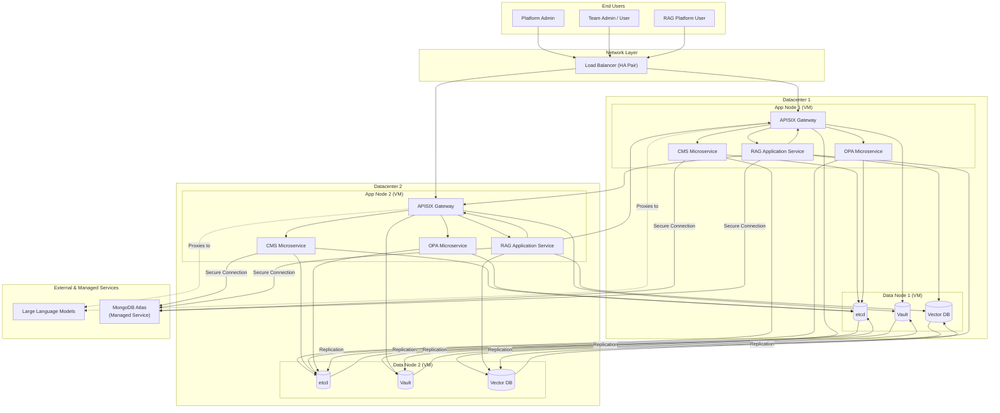
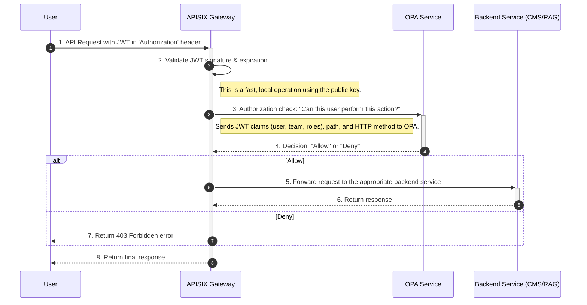
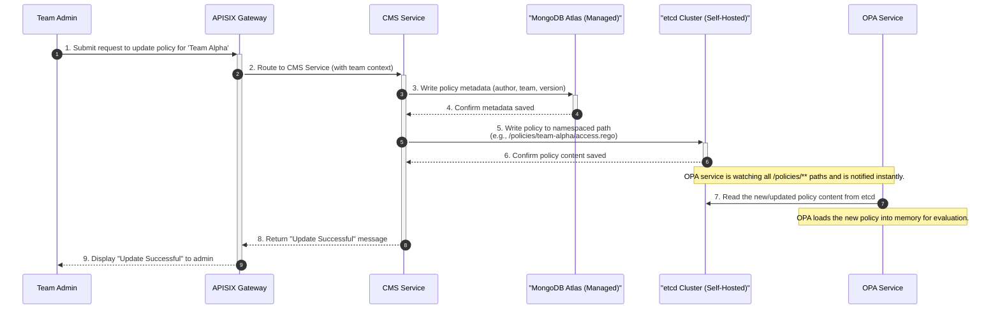
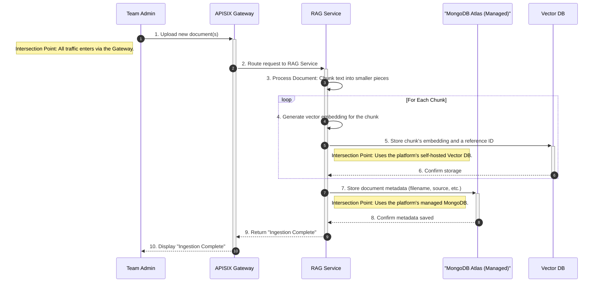
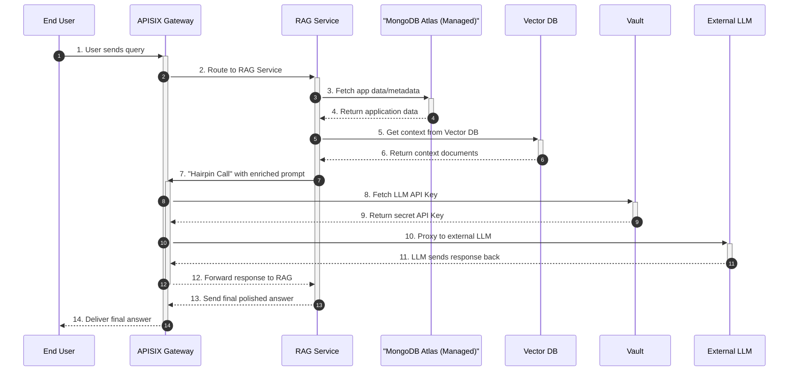

# Definitive Architecture & Core Workflows

This document provides the definitive, comprehensive view of the system architecture. It details the multi-datacenter HA setup, the multi-tenant policy model, and the core operational workflows of the platform.

## 1. High-Availability Architecture Diagram

This diagram shows the complete architecture, including the correct request routing from the APISIX gateway to the backend services. This version is safe to import into `diagrams.net`.

---
## 2. Component Descriptions & Rationale
*(Unchanged from previous version)*

---
## 3. Multi-Tenant Policy Model
*(Unchanged from previous version)*

---
## 4. Core Workflow Sequence Diagrams

This section details the key operational flows within the platform.

### 4.1 Authorization Flow (JWT Validation)

This workflow shows how every incoming API request is authorized. It assumes the user has already authenticated and possesses a valid JWT.

### 4.2 CMS Team-Specific Policy Update Flow

*(Unchanged from previous version)*

### 4.3 RAG Document Ingestion Flow

This high-level workflow shows how new documents are added to the RAG platform. It highlights the intersection points with our core architecture.

### 4.4 RAG Data Retrieval Flow

This workflow details how a user query is answered using the RAG platform.

