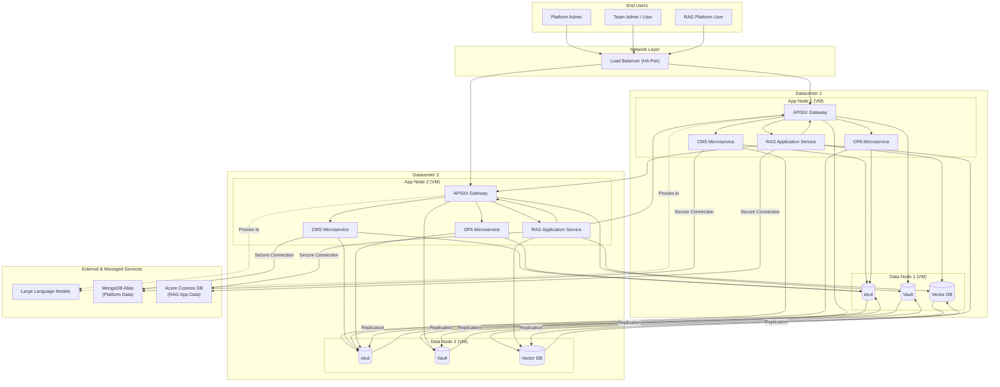
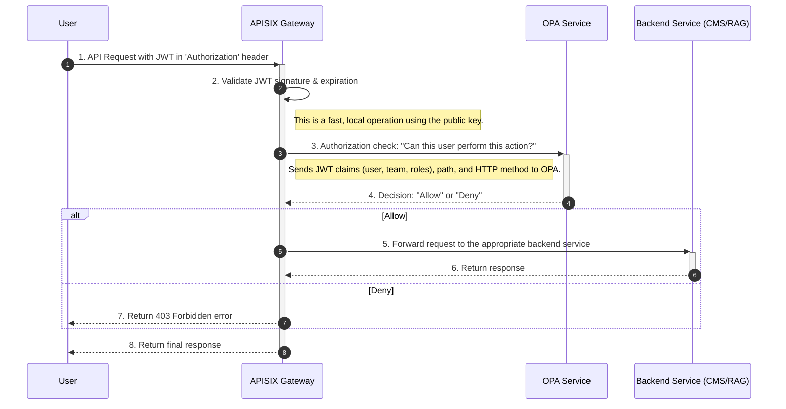
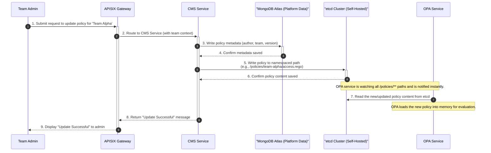
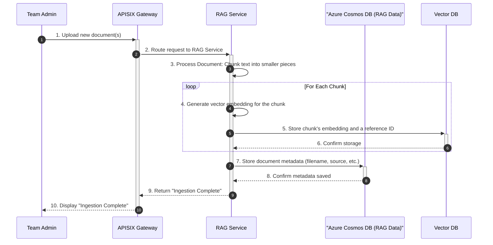
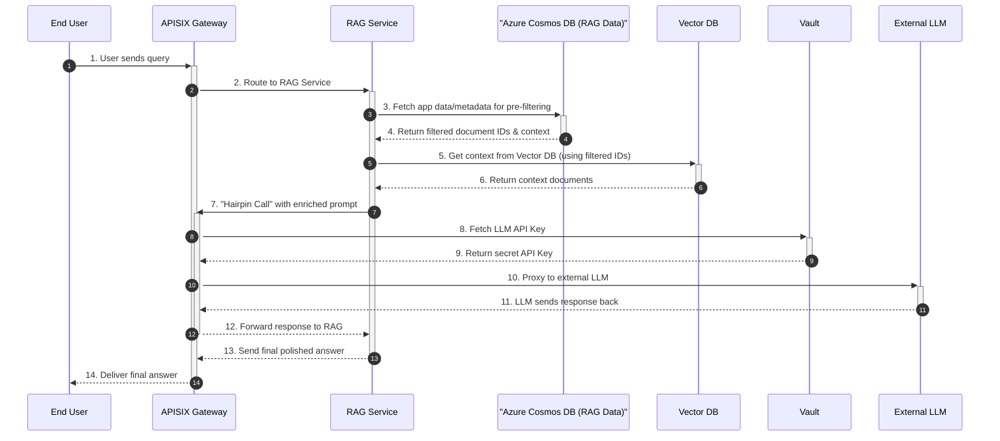

# Definitive Architecture & Core Workflows

## Overview

This document provides the definitive, comprehensive guide to the Configuration Management System (CMS) and its surrounding RAG (Retrieval-Augmented Generation) platform architecture. It is designed to be a single source of truth for engineering teams, detailing not only the components and their connections but also the strategic rationale behind key design decisions.

The primary goals of this architecture are:
- **High Availability:** Ensure system resilience and uptime through a dual-datacenter deployment.
- **Scalability:** Allow individual components to scale independently to meet demand.
- **Security:** Enforce a robust, centralized security model for all operations.
- **Multi-Tenancy:** Enable different teams to use the platform securely and in isolation.
- **Extensibility:** Provide a flexible foundation for adding new features and services.

---

## 1. High-Availability Architecture Diagram

This diagram illustrates the complete, production-grade architecture. It shows the physical deployment across two datacenters, the clear separation of services, and the full data flow.

---

## 2. Component Descriptions & Rationale

This section details each component's role and the reasoning behind its inclusion in the architecture.

#### Network & Gateway
-   **Load Balancer (HA Pair):** The single entry point to the system. Deployed as an Active-Passive High-Availability pair (using a Virtual IP via Keepalived/VRRP) to prevent it from being a single point of failure. It distributes traffic across the APISIX gateways in both datacenters.
-   **APISIX Gateway:** The core of the request management and security enforcement layer. Its responsibilities include:
    -   **Routing:** Directing incoming requests to the correct backend microservice.
    -   **Security:** Validating JWTs and delegating authorization decisions to OPA on every request.
    -   **Centralized Control:** Acts as a "hairpin" proxy for outbound calls to external LLMs, ensuring all traffic is monitored and controlled.
    -   **Plugin Execution:** Stores its configuration and plugin data in the platform's MongoDB instance.

#### Core Platform Services
-   **CMS Microservice:** The "control plane" for managing policies. It provides APIs for teams to create, update, and manage their specific Rego policies and data. It writes policy metadata to MongoDB and the raw policy content to `etcd`.
-   **OPA Microservice (Open Policy Agent):** The "decision engine" for authorization. It is completely stateless. It loads all policies from `etcd` into memory and uses its `watch` feature to receive instant updates. It evaluates requests against these policies to provide "Allow" or "Deny" decisions back to the APISIX gateway.

#### RAG Application
-   **RAG Application Service:** Contains the business logic for the Retrieval-Augmented Generation functionality. It handles document ingestion, pre-filtering, context enrichment, and communication with the LLM (via the hairpin proxy).

#### Data Stores
-   **etcd:** A consistent and highly-available key-value store used exclusively for **live, watchable configuration data**. Its primary role is to store OPA policies, where its `watch` capability allows OPA to update its rules in near real-time without polling.
-   **Vault:** A dedicated, centralized secrets management service. It stores all sensitive data, including database credentials, API keys for external services (like the LLM), and certificates. Services authenticate to Vault to retrieve the secrets they need at runtime.
-   **Vector DB (e.g., Milvus, Weaviate):** A specialized database designed for efficient similarity searching on high-dimensional vector embeddings. It stores the vectorized chunks of ingested documents, forming the "retrieval" backbone of the RAG system.
-   **MongoDB Atlas (Platform Data):** A managed NoSQL database used by the **core platform services**. It stores platform-level data that does not need to be "watched" in real-time, such as CMS policy metadata (author, version history), user roles, and gateway plugin configurations.
-   **Azure Cosmos DB (RAG App Data):** A managed NoSQL database used exclusively by the **RAG Application Service**. This clear separation of concerns allows the RAG team to manage their own data schema. It stores all RAG-specific application data, such as document metadata (source, owner), pre-filtering attributes, and user chat history.

---

## 3. Scalability and High Availability

-   **High Availability:** The architecture achieves HA by deploying across two independent datacenters. All stateful components (`etcd`, `Vault`, `Vector DB`) have their data replicated across both sites. In the event of a full datacenter failure, the Load Balancer can redirect all traffic to the remaining healthy datacenter.
-   **Scalability:** The "App Nodes" (containing APISIX, CMS, OPA, RAG) are designed to be **stateless**. This allows for horizontal scaling. If any service comes under heavy load, new App Node VMs can be provisioned and added to the Load Balancer's pool to increase capacity.

---

## 4. Multi-Tenant Policy Model

The system uses a hybrid policy model to provide both centralized control and delegated flexibility.

-   **Platform-Level Policies:** Managed by Platform Admins. These are global rules that apply to all teams and cannot be overridden. They enforce universal security and operational guardrails.
-   **Team-Level Policies:** Managed by individual teams via the CMS API. These define business logic and access control specific to that team's resources.

During an authorization check, OPA evaluates the request by combining the global platform policies with the specific policies of the team making the request, ensuring both sets of rules are satisfied.

---

## 5. Core Workflow Sequence Diagrams

This section details the key operational flows within the platform.

### 5.1 Authorization Flow (JWT Validation)
This workflow shows how every incoming API request is authorized. It assumes the user has already authenticated with a separate identity provider and possesses a valid JWT.

### 5.2 CMS Team-Specific Policy Update Flow
This flow shows how a Team Admin updates a policy for their specific team, correctly using MongoDB for platform metadata.

### 5.3 RAG Document Ingestion Flow
This high-level workflow shows how new documents are added to the RAG platform, correctly using Cosmos DB for RAG-specific metadata.

### 5.4 RAG Data Retrieval Flow
This flow details how a user query is answered, correctly using Cosmos DB for pre-filtering and metadata retrieval.

