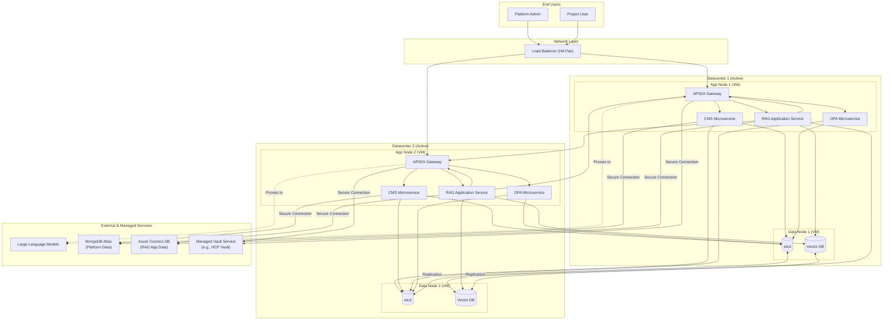
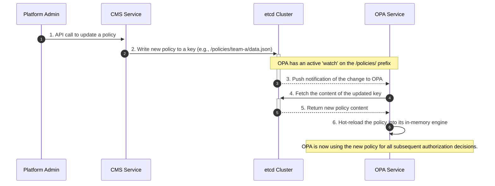

# Definitive Platform Architecture & Core Workflows

## Overview

This document provides the definitive, comprehensive guide to the Configuration Management System (CMS) and its surrounding RAG (Retrieval-Augmented Generation) platform architecture. It is designed to be a single source of truth for engineering teams, detailing not only the components and their connections but also the strategic rationale behind key design decisions.

The primary goals of this architecture are:
- **High Availability:** Ensure system resilience and uptime through an active-active, dual-datacenter deployment.
- **Scalability:** Allow individual components to scale independently to meet demand.
- **Security:** Enforce a robust, centralized security model for all operations.
- **Multi-Tenancy:** Enable different teams to use the platform securely and in isolation.
- **Extensibility:** Provide a flexible foundation for adding new features and services.

---

## 1. High-Availability Architecture Diagram

This diagram illustrates the complete, production-grade architecture. It shows the active-active deployment across two datacenters and the clear separation between self-hosted and managed services.



---

## 2. Component Descriptions & Rationale
*(This section is unchanged)*

---

## 3. Scalability and High Availability

-   **High Availability (Active-Active):** The architecture is deployed in an **active-active** configuration across two datacenters. The Load Balancer continuously distributes traffic to application nodes in **both** datacenters. This maximizes resource utilization and provides seamless failover. If an entire datacenter becomes unavailable, the Load Balancer's health checks will fail, and it will automatically route 100% of the traffic to the remaining healthy datacenter with no manual intervention.
-   **Scalability:** The "App Nodes" are stateless, allowing for horizontal scaling. If any service comes under heavy load, new App Node VMs can be provisioned and added to the Load Balancer's pool to increase capacity.

---

## 4. API Endpoint Specification

The CMS service exposes a RESTful API for managing policies. Access is governed by the user's role, which is determined from their JWT.

### 4.1 Policy Object Schema
A policy object consists of Rego code and a JSON data file.

```json
{
  "rego": "package project.authz\n\ndefault allow = false\n\nallow {\n  input.user.role == \"admin\"\n}",
  "data": {
    "valid_roles": ["admin", "viewer"]
  }
}
```

### 4.2 Endpoints

#### Get Policies
-   **`GET /policies/{project_name}`**
    -   **Description:** Retrieves the policy object for a specific project.
    -   **Permissions:**
        -   `Project User`: Allowed if `{project_name}` matches their assigned project.
        -   `Platform Admin`: Always allowed.
    -   **Success Response:** `200 OK` with the policy object.

-   **`GET /policies/platform`**
    -   **Description:** Retrieves the global platform-level policy object.
    -   **Permissions:** `Platform Admin` only.
    -   **Success Response:** `200 OK` with the policy object.

#### Update Policies
-   **`PUT /policies/{project_name}`**
    -   **Description:** Creates or fully updates the policy object for a specific project.
    -   **Permissions:** `Platform Admin` only.
    -   **Request Body:** Must contain a full policy object.
    -   **Success Response:** `200 OK` (on update) or `201 Created` (on creation).

-   **`PUT /policies/platform`**
    -   **Description:** Creates or fully updates the global platform-level policy object.
    -   **Permissions:** `Platform Admin` only.
    -   **Request Body:** Must contain a full policy object.
    -   **Success Response:** `200 OK` (on update) or `201 Created` (on creation).

---

## 5. Real-Time Policy Propagation (`etcd` & OPA)

A critical feature of the architecture is the ability for policy changes to be reflected instantly without service restarts. This is achieved through the interaction between the CMS, `etcd`, and OPA.

When an admin updates a policy via the CMS API, the CMS writes the new Rego code or data file to a specific key in `etcd`. The OPA instances are not polling `etcd`; instead, they use `etcd`'s powerful **`watch`** feature. Each OPA instance establishes a persistent connection to the `etcd` cluster and subscribes to all changes under the `/policies/` prefix.

When a key is updated, `etcd` immediately pushes a notification to all subscribed OPA instances. Upon receiving this notification, OPA fetches the new policy content and updates its in-memory evaluation engine. This entire process is asynchronous and happens in milliseconds, ensuring that authorization decisions are always based on the most current policies.

### Workflow: Real-Time Policy Propagation

This diagram illustrates the background process that occurs when a policy is updated.



---

## 6. Core Workflow Sequence Diagrams
*(This section contains the other workflows: Authorization, Ingestion, and Retrieval, and is unchanged)*
