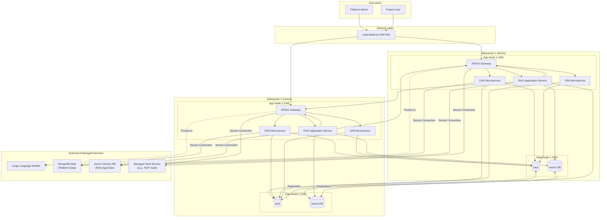
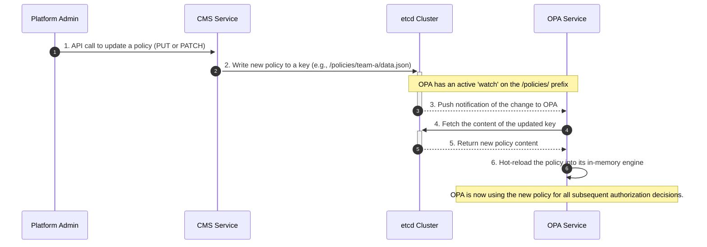
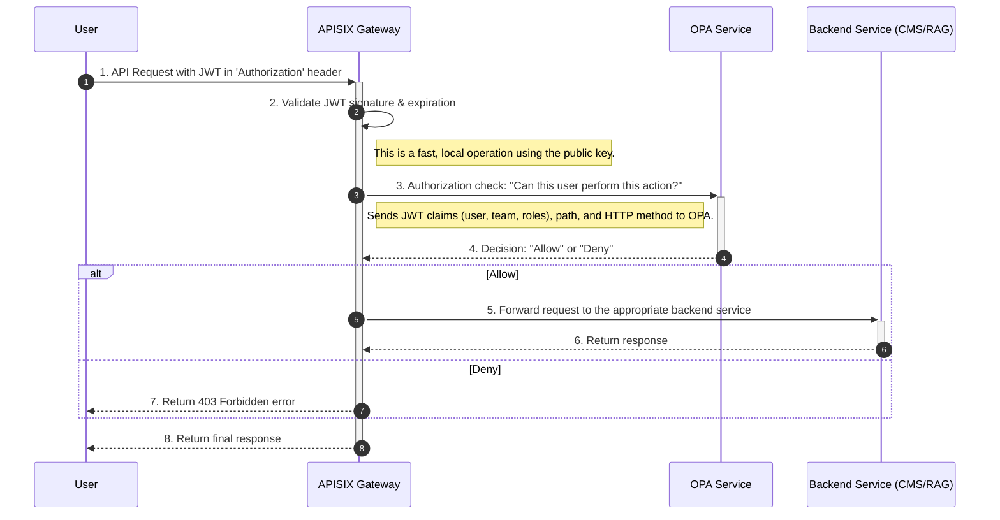
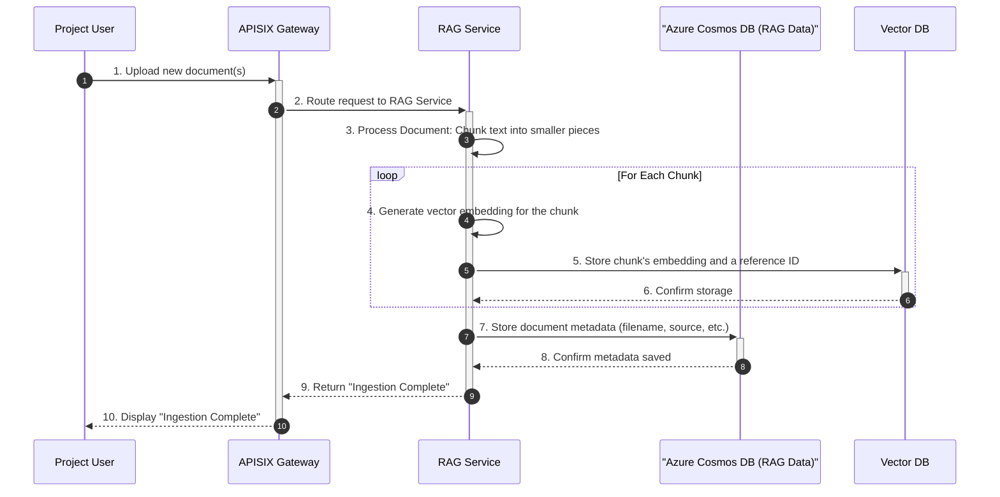
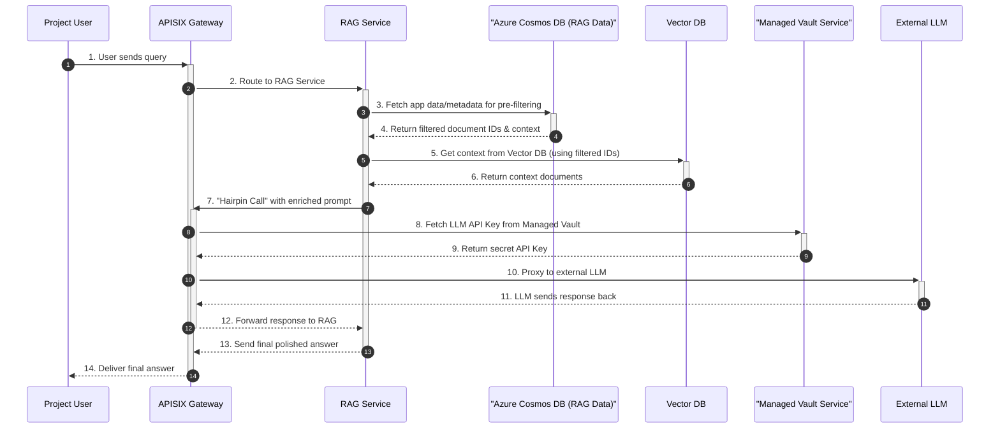

# Definitive Platform Architecture & Core Workflows

## 1. Overview

This document provides the definitive, comprehensive guide to the Configuration Management System (CMS) and its surrounding RAG (Retrieval-Augmented Generation) platform architecture. It is designed to be a single source of truth for engineering teams, detailing not only the components and their connections but also the strategic rationale behind key design decisions.

The primary goals of this architecture are:
- **High Availability:** Ensure system resilience and uptime through an active-active, dual-datacenter deployment.
- **Scalability:** Allow individual components to scale independently to meet demand.
- **Security:** Enforce a robust, centralized security model for all operations.
- **Multi-Tenancy:** Enable different teams to use the platform securely and in isolation.
- **Extensibility:** Provide a flexible foundation for adding new features and services.

---

## 2. High-Availability Architecture Diagram

This diagram illustrates the complete, production-grade architecture. It shows the active-active deployment across two datacenters and the clear separation between self-hosted and managed services.



---

## 3. Component Descriptions & Rationale

This section details each component's role and the reasoning behind its inclusion in the architecture.

#### Network & Gateway
-   **Load Balancer (HA Pair):** The single entry point to the system. Deployed as an Active-Passive High-Availability pair to prevent it from being a single point of failure. It distributes traffic across the APISIX gateways in both datacenters.
-   **APISIX Gateway:** The core of the request management and security enforcement layer. Its responsibilities include routing, security enforcement (JWT validation, OPA delegation), and acting as a centralized "hairpin" proxy for all outbound LLM traffic.

#### Core Platform Services
-   **CMS Microservice:** The "control plane" for managing policies. It provides APIs for teams to manage their Rego policies, writing metadata to MongoDB and raw policy content to `etcd`.
-   **OPA Microservice (Open Policy Agent):** The stateless "decision engine" for authorization. It loads all policies from `etcd` into memory and uses its `watch` feature to receive instant updates, providing "Allow" or "Deny" decisions to APISIX.

#### RAG Application
-   **RAG Application Service:** Contains the business logic for the RAG functionality, handling document ingestion, pre-filtering, context enrichment, and communication with the LLM.

#### Self-Hosted Data Stores
-   **etcd:** A consistent key-value store used exclusively for **live, watchable configuration data**, primarily OPA policies. Its `watch` capability is critical for near real-time policy propagation.
-   **Vector DB (e.g., Milvus, Weaviate):** A specialized database for efficient similarity searching on vector embeddings. It stores the vectorized chunks of ingested documents.

#### Managed Services
-   **Managed Vault Service (e.g., HCP Vault):** A dedicated, centralized secrets management service provided by a cloud vendor. This is a critical strategic choice to **offload the significant operational burden** of managing, securing, and maintaining a highly available Vault cluster. It stores all sensitive data, including database credentials and API keys. Services authenticate to the managed service endpoint to retrieve secrets at runtime.
-   **MongoDB Atlas (Platform Data):** A managed NoSQL database used by the **core platform services** (CMS, APISIX) for data that does not need to be "watched," such as policy metadata, user roles, and gateway plugin configurations.
-   **Azure Cosmos DB (RAG App Data):** A managed NoSQL database used exclusively by the **RAG Application Service**. This clear separation of concerns allows the RAG team to manage their own data schema for document metadata, pre-filtering attributes, and user chat history.
-   **Large Language Models (LLM):** External, third-party AI services that provide the generative capabilities for the RAG system.

---

## 4. Scalability and High Availability

-   **High Availability (Active-Active):** The architecture is deployed in an **active-active** configuration across two datacenters. The Load Balancer continuously distributes traffic to application nodes in **both** datacenters. This maximizes resource utilization and provides seamless failover. If an entire datacenter becomes unavailable, the Load Balancer's health checks will fail, and it will automatically route 100% of the traffic to the remaining healthy datacenter with no manual intervention.
-   **Scalability:** The "App Nodes" are stateless, allowing for horizontal scaling. If any service comes under heavy load, new App Node VMs can be provisioned and added to the Load Balancer's pool to increase capacity.

---

## 5. API Endpoint Specification

The CMS service exposes a RESTful API for managing policies. Access is governed by the user's role, which is determined from their JWT.

### 5.1 Policy Object Schema
A policy object consists of Rego code and an optional JSON data file.

```json
{
  "rego": "package project.authz\n\ndefault allow = false\n\nallow {\n  input.user.role == \"admin\"\n}",
  "data": {
    "valid_roles": ["admin", "viewer"]
  }
}
```

### 5.2 Endpoints

#### Get Policies
-   **`GET /policies/{project_name}`**
    -   **Description:** Retrieves the policy object for a specific project.
    -   **Permissions:**
        -   `Project User`: Allowed if `{project_name}` matches their assigned project.
        -   `Platform Admin`: Always allowed.
    -   **Success Response:** `200 OK` with the policy object.

-   **`GET /policies/platform`**
    -   **Description:** Retrieves the global platform-level policy object.
    -   **Permissions:** `Platform Admin` only.
    -   **Success Response:** `200 OK` with the policy object.

#### Create or Full Update (Replace)
-   **`PUT /policies/{project_name}`**
    -   **Description:** Creates or fully replaces the policy object for a specific project.
    -   **Permissions:** `Platform Admin` only.
    -   **Request Body:** Must contain a full policy object (with at least the `rego` key).
    -   **Success Response:** `200 OK` (on update) or `201 Created` (on creation).

-   **`PUT /policies/platform`**
    -   **Description:** Creates or fully replaces the global platform-level policy object.
    -   **Permissions:** `Platform Admin` only.
    -   **Request Body:** Must contain a full policy object (with at least the `rego` key).
    -   **Success Response:** `200 OK` (on update) or `201 Created` (on creation).

#### Partial Update
-   **`PATCH /policies/{project_name}`**
    -   **Description:** Partially updates a policy object. Allows for updating just the `rego` code or just the `data` file without sending the other.
    -   **Permissions:** `Platform Admin` only.
    -   **Request Body:** A JSON object containing *either* a `rego` key, a `data` key, or both.
    -   **Success Response:** `200 OK`.

-   **`PATCH /policies/platform`**
    -   **Description:** Partially updates the global platform-level policy object.
    -   **Permissions:** `Platform Admin` only.
    -   **Request Body:** A JSON object containing *either* a `rego` key, a `data` key, or both.
    -   **Success Response:** `200 OK`.

---

## 6. Real-Time Policy Propagation (`etcd` & OPA)

A critical feature of the architecture is the ability for policy changes to be reflected instantly without service restarts. This is achieved through the interaction between the CMS, `etcd`, and OPA.

When an admin updates a policy via the CMS API, the CMS writes the new Rego code or data file to a specific key in `etcd`. The OPA instances are not polling `etcd`; instead, they use `etcd`'s powerful **`watch`** feature. Each OPA instance establishes a persistent connection to the `etcd` cluster and subscribes to all changes under the `/policies/` prefix.

When a key is updated, `etcd` immediately pushes a notification to all subscribed OPA instances. Upon receiving this notification, OPA fetches the new policy content and updates its in-memory evaluation engine. This entire process is asynchronous and happens in milliseconds, ensuring that authorization decisions are always based on the most current policies.

### Workflow: Real-Time Policy Propagation

This diagram illustrates the background process that occurs when a policy is updated.



---

## 7. Core Workflow Sequence Diagrams

This section details other key operational flows within the platform.

### 7.1 Authorization Flow (JWT Validation)
This workflow shows how every incoming API request is authorized. It assumes the user has already authenticated with a separate identity provider and possesses a valid JWT.



### 7.2 RAG Document Ingestion Flow
This high-level workflow shows how new documents are added to the RAG platform.



### 7.3 RAG Data Retrieval Flow
This flow details how a user query is answered.


V