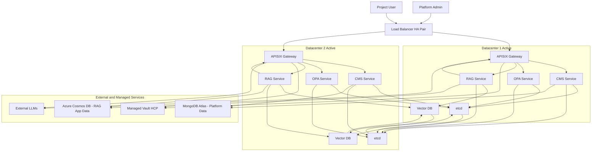
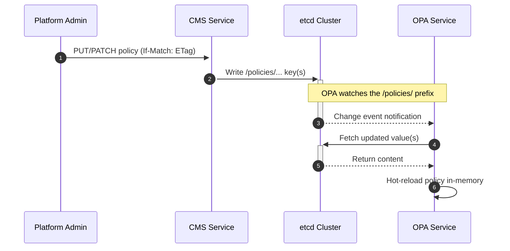
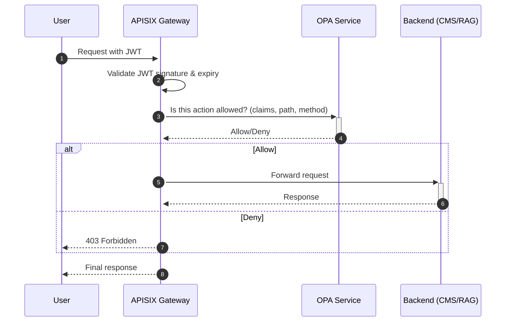
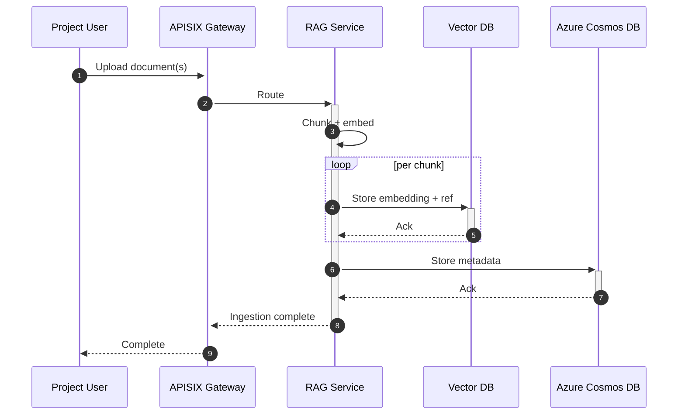
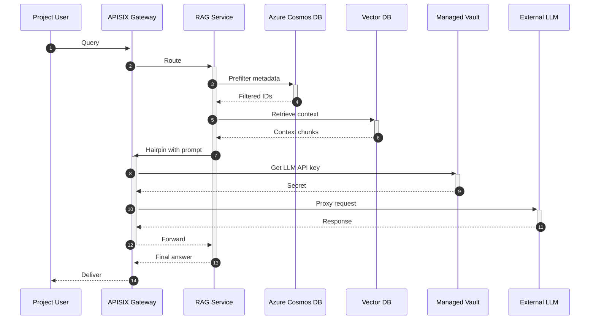

# Definitive CMS + RAG Platform Architecture (Production-Ready) — With Traceability & Audit (MVP1)

This file mirrors `readme18.md` and adds a concise, MVP-friendly section on traceability, audit, idempotency, and rollback.

## 1. Purpose

Authoritative, self-contained specification for the Configuration Management System (CMS) and its integration with a Retrieval-Augmented Generation (RAG) platform. This document covers architecture, APIs, workflows, non-functionals, security, and operations for a senior-architect review.

Goals:
- High availability with dual active datacenters and seamless failover
- Horizontal scalability of stateless services
- Strong security and centralized policy enforcement
- Clear multi-tenancy (platform vs. team/project)
- Operational simplicity via managed services where it matters

---

Note: Local MVP (Laptop) mapping
- For quick validation on a single machine, we run only three services: CMS, OPA, and etcd. This demonstrates Section 6.1 (real-time policy propagation) end-to-end.
- In local mode we omit APISIX, Vector DB, and managed services (Vault, Atlas/Cosmos). Calls to OPA are made directly for testing.
- Propagation detail: In production, OPA would load policies via a watch/bundle workflow; in this MVP CMS only writes to etcd, and a small etcd→OPA watcher sync pushes updates to OPA in real time.
- See `readme/README-run.md` for exact local run and verification steps.


## 2. Architecture (Active-Active, Dual-DC)



Key decisions
- Load Balancer: HA pair (active-passive) to eliminate single point of failure; DCs are active-active behind it.
- APISIX: single ingress and egress policy enforcement point; JWT validation + OPA authorization; hairpin proxy for LLMs.
- CMS: control plane for policies; writes metadata to Atlas, live policy content to etcd.
- OPA: stateless decision engine; watches etcd for instant policy updates.
- Data separation: Atlas for platform metadata; Cosmos DB for RAG app data; Vault for secrets; Vector DB for embeddings.

Note on etcd topology
- Production consensus requires 3 or 5 members. Recommended layout: 3-node cluster spread as 2 members in DC1 and 1 in DC2 (or vice-versa). Diagram shows one per DC for simplicity; implement 3 members in practice.

---

## 3. Multi-Tenancy Model

- Platform scope: global policies that apply across projects (e.g., org-wide rules, default deny/allow conditions).
- Project scope: team/project-specific policies. Project users can read their own policies; only platform admins can write.
- Enforced by APISIX + OPA using JWT claims (tenant, roles, project) and request attributes (method, path).

---

## 4. Policy Storage Model (etcd + OPA)

Key layout (prefix-watchable by OPA):
- /policies/platform/rego.rego
- /policies/platform/data.json
- /policies/projects/{project}/rego.rego
- /policies/projects/{project}/data.json

OPA configuration (illustrative):
```yaml
services:
  - name: etcd
    url: http://etcd:2379
    credentials:
      bearer:
        token: ${ETCD_TOKEN}

bundles: {}

# Load from etcd using discovery via "watch" (using OPA's data store plugin for etcd or external sync)
discovery:
  name: config

# If using sidecar sync to etcd: OPA watches keys under /policies/ prefix.
```

Real-time updates
- CMS writes keys under /policies/…; etcd emits watch events; all OPAs hot-reload policies immediately.
- Use compact, human-readable values: plain text for rego, JSON for data.

Versioning & concurrency
- Include ETag (policy version) in GET responses derived from etcd revision or explicit version in Atlas.
- PUT/PATCH must honor If-Match for optimistic concurrency control (409 on mismatch).

---

## 5. CMS Policy API (REST)

Authentication & authorization
- Authentication: JWT (RS256). APISIX validates signature and expiry.
- Authorization: APISIX queries OPA with input {claims, path, method}.

Policy object
```json
{
  "rego": "package project.authz\n\ndefault allow = false\n\nallow { input.user.role == \"admin\" }",
  "data": { "valid_roles": ["admin", "viewer"] }
}
```

Endpoints
- GET /policies/{project}
  - Returns project policy; 200 with object; 404 if missing; ETag header present.
- GET /policies/platform
  - Returns platform policy; 200; 404 if missing; ETag header present.
- PUT /policies/{project}
  - Create/replace; body must include rego; optional data; requires If-Match when updating existing; 201/200; 400 on invalid.
- PUT /policies/platform
  - Same semantics as above at platform scope.
- PATCH /policies/{project}
  - Partial update; accepts rego and/or data; requires If-Match; 200.
- PATCH /policies/platform
  - Partial update at platform scope; 200.

Errors (representative)
- 400 validation_error: malformed JSON, schema violations
- 401 unauthorized: missing/invalid JWT
- 403 forbidden: insufficient role
- 404 not_found: policy not present
- 409 conflict: ETag mismatch
- 413 payload_too_large: exceeds configured limits

Limits & size guidance
- rego: default max 512 KiB; data: default max 1 MiB (configurable). Larger payloads should be split logically across packages or data entries.

Audit & idempotency
- All writes produce audit events (who, when, what keys) to centralized logging.
- Idempotency-Key optional header for PUT to guard against retries (logged and enforced by CMS).

---

## 6. Core Workflows

### 6.1 Real-Time Policy Propagation


### 6.2 Authorization Flow


### 6.3 RAG Ingestion


### 6.4 RAG Retrieval


---

## 7. Security Architecture

- Identity: External IdP issues JWTs (RS256). Public keys cached at APISIX.
- Authorization: OPA policies gate every request. Inputs include JWT claims, method, path, and request context.
- Secrets: Managed Vault; apps use short-lived tokens (e.g., AppRole), least privilege policies, and periodic rotation.
- Transport security: TLS everywhere; mTLS between APISIX and backend services; certificate automation via ACME/private PKI.
- Data protection: Encrypt at rest (Atlas/Cosmos/VDB), encrypt in transit, narrow network ACLs between tiers.

---

## 8. Observability & Operations

- Metrics: APISIX, OPA decision latency/denials, CMS API latency/error rate, etcd watch lag, VDB query latency, RAG end-to-end latency.
- Logs: Structured JSON; centralized aggregation; policy write audit logs and APISIX access logs with trace IDs.
- Tracing: Distributed tracing (W3C trace-context) across APISIX -> services -> DBs.
- SLOs (example starting point):
  - 99.9% monthly availability for API
  - P95 decision latency < 20 ms (OPA)
  - P95 policy propagation < 500 ms (CMS -> OPA)

Runbook
- Backups: Atlas/Cosmos managed backups; etcd periodic snapshots; VDB native backups.
- DR: LB failover verified; chaos drills for DC loss; documented RTO/RPO.
- Capacity: Horizontal scale app nodes; monitor etcd quorum and latency; maintain 3-member etcd.

---

## 9. Risks & Mitigations

- etcd quorum across DCs can add latency: place 2 voters in primary DC and 1 in secondary; avoid even-numbered voters.
- Large policy data can bloat evaluation: keep rego small and data lightweight; precompute heavy lookups; use indexes in data.
- Secret sprawl: force all outbound API keys through Vault; deny direct env var secrets in code repos.

---

## 10. Quick Reference

- Active-active DCs; LB HA pair
- APISIX as single ingress/egress control point
- CMS writes policies to etcd; OPA watches and hot-reloads
- Atlas for platform metadata; Cosmos for RAG app data; Vault for secrets
- API supports GET/PUT/PATCH with ETag + If-Match and clear error model

---

## 11. Traceability, Audit, Idempotency, and Rollback (MVP1)
Basic scope for MVP1 (keep it simple):

- Traceability
  - Gateway adds `X-Request-ID` if missing; services echo it in a single JSON log line: ts, service, level, request_id, method, path, status, latency_ms.

- Policy change audit (CMS only)
  - On PUT/PATCH, emit one audit JSON with: ts, actor, action, resource, etag_before, etag_after, result, request_id, client_ip. Store in central logs; retain 30–90 days.

- Concurrency and idempotency
  - Require `If-Match` on updates; return 409 on mismatch.
  - Optional `Idempotency-Key` to dedupe retries for 24h (best-effort cache).

- Versioning and rollback
  - Keep last 5 versions per policy in Atlas collection `policy_versions` {scope, project?, version, etag, ts, actor, rego, data}.
  - Rollback by PUT-ing the chosen snapshot with `If-Match` set to the current ETag.

Deferred beyond MVP1: signed/hash-chained audits, immutable archive (WORM), OPA decision logs, and two-person approvals.
