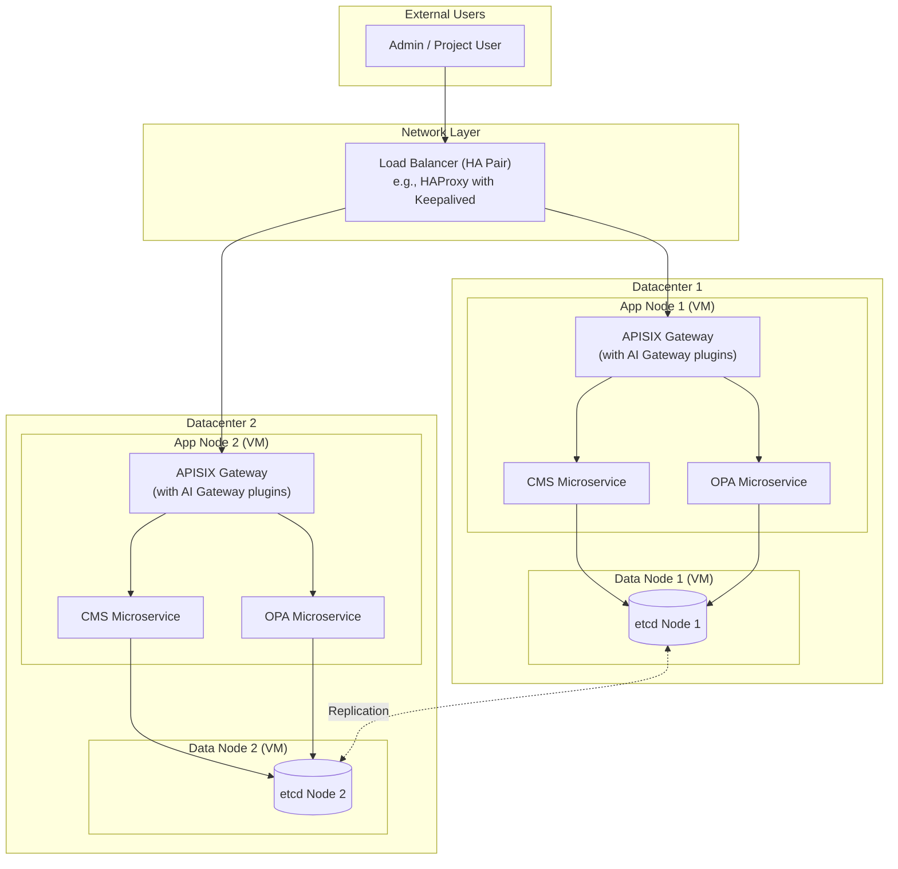

# Configuration Management System (CMS) - MVP1 Architecture

This document outlines the simplified, production-focused architecture for the Minimum Viable Product (MVP1) of the Configuration Management System.

## MVP1 Goals & Constraints

- **Infrastructure:** 2 Datacenters, with 2 Virtual Machines (VMs) in each (4 VMs total).
- **Focus:** Deliver core functionality with a stable, secure, and scalable foundation.
- **Simplicity:** Keep the initial deployment and management as simple as possible while following best practices.

## High-Level Architecture (MVP1)

For the MVP, we will use a **role-based separation** model. This provides better stability and a clear path for future scaling compared to running all services on every VM.

The 4 VMs will be divided into two roles:
- **2x Application Nodes** (one in each datacenter)
- **2x Data Nodes** (one in each datacenter)

### Architecture Diagram

### Component Roles

#### 1. Application Nodes (2 VMs)
- **Purpose:** Handle all incoming API requests, execute business logic, and enforce policies. These are the "stateless" workhorses of the system.
- **Services Running:**
    - **APISIX API Gateway:** The single entry point for all traffic. It will handle SSL termination, authentication, and routing to the CMS service.
    - **CMS Microservice:** The core application logic for managing configurations.
    - **OPA Microservice:** The policy engine that makes authorization decisions.

#### 2. Data Nodes (2 VMs)
- **Purpose:** Provide a stable, consistent, and replicated data store for the entire system. This layer is "stateful".
- **Services Running:**
    - **etcd:** A distributed key-value store used to save all OPA policies and configuration metadata. The two nodes will be configured to replicate data between datacenters.

### Request Flow

1.  A user sends a request to the system's public address.
2.  The **Load Balancer** receives the request and forwards it to one of the active **Application Nodes** (either in DC1 or DC2).
3.  **APISIX** on that node receives the request and routes it to the **CMS Microservice**.
4.  The CMS Microservice interacts with **OPA** for policy checks and with **etcd** on its corresponding **Data Node** to read or write configuration data.
5.  Data written to one `etcd` node is automatically **replicated** to the `etcd` node in the other datacenter.

### Why This Design is Better for MVP

- **Stability:** By separating the data layer (`etcd`) from the application layer, we prevent traffic spikes or application crashes from impacting the database.
- **Scalability:** This design provides a clear path for growth. If more processing power is needed, we can simply add more **Application Nodes** without changing the data layer.
- **Security:** It creates a security boundary between the internet-facing gateway and the core data store.
- **Troubleshooting:** It's easier to diagnose problems. If there's a performance issue, we can quickly determine if it's in the application layer or the data layer.

### Justification for Role-Based Separation (Especially for Kubernetes Migration)

The decision to separate VMs into "Application Nodes" and "Data Nodes" is a strategic one that provides immediate stability and dramatically simplifies the planned migration to Kubernetes (MVP2).

1.  **Mirrors Kubernetes Principles Today**: This architecture is a direct precursor to a standard Kubernetes deployment.
    *   **Application Nodes** act like a stateless **`Deployment`**. They are the workhorses that can be scaled or replaced easily.
    *   **Data Nodes** act like a **`StatefulSet`**. They manage persistent data, have stable identities, and are managed more carefully.
    By adopting this model now, your team is already operating with a cloud-native mindset.

2.  **De-risks the Future Kubernetes Migration**: The biggest challenge when moving to Kubernetes is managing state.
    *   You will have **already solved the hard problem** of separating your stateless application logic from your stateful database.
    *   The migration path becomes a much simpler "re-platforming" exercise (wrapping existing components in Kubernetes objects) rather than a complex and risky re-architecture.

3.  **Ensures Critical Stability**:
    *   **Resource Isolation**: A bug or traffic spike on an Application Node (e.g., a memory leak in the CMS service) cannot crash the `etcd` database, preventing data corruption.
    *   **Independent Failure**: If an App Node goes down, the data layer is completely unaffected. The Load Balancer simply redirects traffic to the healthy App Node, ensuring high availability.

4.  **Provides a Clear and Independent Scalability Path**:
    *   **Scale Applications**: If your API needs more processing power, you can add more Application Nodes without touching the data layer.
    *   **Scale Data**: If the database becomes a bottleneck, you can scale the Data Nodes independently. This is a core principle of a scalable microservices architecture.

This architecture provides a robust and professional foundation for MVP1, ensuring that the system is reliable and ready for future expansion.
