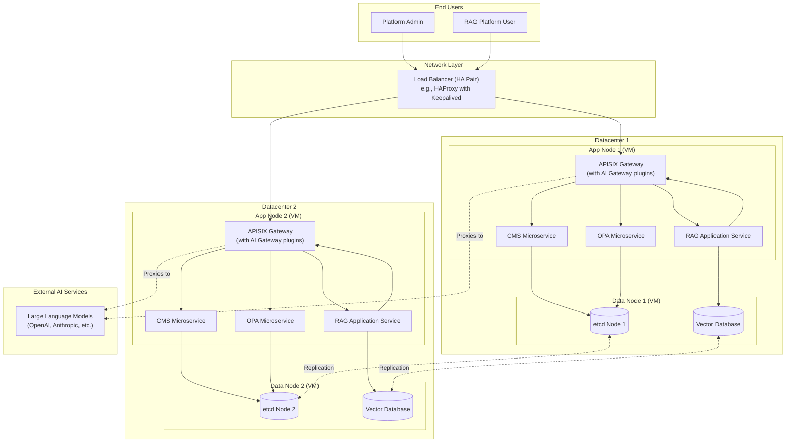

# CMS & RAG Platform Architecture (MVP1 + LLM Integration)

This document extends the MVP1 architecture to include the RAG-based platform and illustrates how Large Language Model (LLM) traffic is managed through the existing APISIX API Gateway.

## Core Principle: Centralized LLM Traffic Management

All requests to external LLM providers (e.g., OpenAI, Anthropic, Azure AI) will be routed through our APISIX API Gateway. This is a critical design decision that provides centralized control, security, and observability for all AI-powered features.

## Integrated Architecture Diagram

This diagram shows the complete system, including the new RAG Platform services and the flow of LLM requests.

### New Components

-   **RAG Application Service:** This is the backend for your RAG platform. It handles user queries, retrieves relevant documents from the Vector DB, constructs the prompt, and (as we will see) calls the LLM.
-   **Vector Database:** A specialized database (like Weaviate, Pinecone, or Milvus) that stores document embeddings for fast similarity searches. It is a stateful service and thus belongs on the **Data Nodes**.
-   **Large Language Models (LLMs):** These are the external, third-party AI services that your platform will call.

### LLM Request Flow Explained

This is the most important new flow in the diagram. It might look circular at first, but it's a powerful pattern called a **"hairpin" or "reflexive" proxy**.

1.  A RAG platform user sends a query to the system (e.g., "What is etcd?").
2.  The request goes through the **Load Balancer** to an **App Node** (e.g., App Node 1).
3.  **APISIX** routes the request to the **RAG Application Service**.
4.  The RAG service queries the **Vector Database** to find relevant context documents.
5.  Now, the RAG service needs to call an LLM. Instead of connecting directly to the internet, it makes a request back to its **local APISIX Gateway** at a special endpoint (e.g., `http://localhost:9080/llm/openai/chat/completions`).
6.  **APISIX's AI Gateway plugins** intercept this request. They perform several critical functions:
    *   **Authentication:** Securely inject the correct API key for the LLM provider.
    *   **Rate Limiting:** Ensure the RAG app doesn't exceed its budget or API limits.
    *   **Logging & Metrics:** Log the request and track token usage for observability.
    *   **Caching:** Check if the same request has been made recently and return a cached response to save money and time.
7.  APISIX then proxies the request to the actual **external LLM provider**.
8.  The response from the LLM flows back through APISIX (where it can be cached) to the RAG service, which then sends the final answer to the user.

### Why This Flow is the Correct Professional Approach

-   **Zero Trust Security:** The RAG application servers do not need direct internet access or knowledge of sensitive LLM API keys. The keys are securely managed and injected by APISIX.
-   **Centralized Control:** If you want to add a new LLM provider, switch models, or change the rate limits, you only need to change the configuration in one place: APISIX. No application code needs to be redeployed.
-   **Cost Management & Observability:** The AI Gateway plugins give you a single dashboard to monitor all LLM costs, usage, and performance across the entire platform.
-   **Resilience:** APISIX can be configured to automatically retry failed requests or even failover to a different LLM provider if one is down.

This architecture correctly integrates your RAG platform into the existing secure and scalable infrastructure, providing a robust foundation for building powerful AI features.
