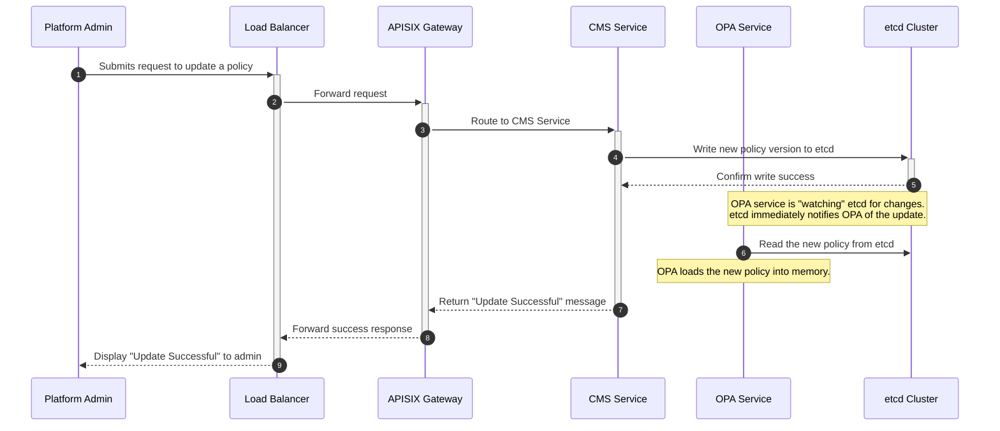

# System Workflows Explained

This document provides explicit, step-by-step diagrams for the key data flows within the CMS and RAG platform architecture.

## 1. End-to-End RAG Query Flow

This is the complete lifecycle of a query from a RAG platform user. It illustrates both the initial request and the final response paths, including the critical "hairpin" call to the LLM.

### RAG Query Sequence Diagram

```mermaid
sequenceDiagram
    participant USER as End User
    participant LB as Load Balancer
    participant APISIX as APISIX Gateway
    participant RAG as RAG Service
    participant VDB as Vector DB
    participant LLM as External LLM

    autonumber

    %% --- Request Path ---
    box LightBlue Request Path (User to RAG Service)
        USER->>+LB: User submits query (e.g., "What is etcd?")
        LB->>+APISIX: Forward request
        APISIX->>+RAG: Route to RAG Service
    end

    %% --- Internal Processing ---
    box LightYellow Internal Processing & Hairpin Call
        RAG->>+VDB: Retrieve relevant context from Vector DB
        VDB-->>-RAG: Return context documents
        RAG->>+APISIX: **Hairpin Call:** Send enriched prompt to local APISIX endpoint
        APISIX->>+LLM: Proxy request to external LLM (injects key, logs, etc.)
        LLM-->>-APISIX: Return raw text response
        APISIX-->>-RAG: Forward LLM response (caches it, logs tokens)
    end

    Note over RAG: RAG service now polishes the final answer:<br/>- Adds citations from context documents<br/>- Formats the output (e.g., into JSON)<br/>- Performs final quality checks

    %% --- Response Path ---
    box LightGreen Response Path (RAG Service to User)
        RAG-->>-APISIX: **Send final, polished answer back through the gateway**
        APISIX-->>-LB: Forward response (adds headers, compresses, etc.)
        LB-->>-USER: Deliver complete answer to user's browser
    end
```

### Step-by-Step Explanation

1.  **User Submits Query:** The end-user sends a request from their browser to the platform's main address.
2.  **Load Balancer:** The request hits the Load Balancer, which forwards it to a healthy Application Node.
3.  **APISIX Routes Inbound:** The APISIX Gateway on the App Node receives the request and, based on the URL, routes it to the RAG Application Service running on the same machine.
4.  **Retrieve Context:** The RAG service queries the Vector Database to find documents relevant to the user's query.
5.  **Return Context:** The Vector DB returns the relevant text snippets.
6.  **Hairpin Call to APISIX:** The RAG service constructs a prompt containing the user's query and the retrieved context. It then sends this prompt to its **local APISIX Gateway**, not directly to the internet.
7.  **Proxy to LLM:** APISIX's AI Gateway plugins process this internal request, add the necessary API keys, and securely proxy it to the external LLM provider.
8.  **LLM Response:** The LLM generates a response and sends it back to APISIX.
9.  **Forward to RAG:** APISIX receives the LLM's raw response, logs the token usage, potentially caches the result, and forwards it back to the RAG service.
10. **Polish the Final Answer:** The RAG service takes the raw LLM text and enriches it, adding citations from the context documents and formatting it for the user.
11. **Send Final Response via APISIX:** The RAG service sends its final, polished answer back out. **Crucially, this response travels back through the APISIX Gateway.**
12. **APISIX Processes Outbound:** APISIX can perform final actions on the response, such as compressing it or adding security headers.
13. **Deliver to User:** The response travels back through the Load Balancer to the user's browser, completing the round trip.

---

## 2. CMS Policy Update Flow

This diagram shows how a Platform Admin updates a policy in the system.

### Policy Update Sequence Diagram



### Step-by-Step Explanation

1.  **Admin Submits Request:** A Platform Admin uses a UI or CLI to submit a change to an OPA policy.
2.  **Load Balancer:** The request is forwarded to an active Application Node.
3.  **APISIX Routes to CMS:** APISIX identifies the request as a configuration management task and routes it to the CMS Microservice.
4.  **Write to etcd:** The CMS service validates the new policy and writes it to the `etcd` cluster.
5.  **etcd Confirms:** `etcd` persistently saves the data and confirms the write was successful.
6.  **Real-time Notification:** The OPA microservice, which maintains a persistent watch on the policy keys in `etcd`, is instantly notified of the change.
7.  **OPA Loads New Policy:** The OPA service reads the new policy from `etcd` and loads it into its memory for immediate use in authorization decisions.
8.  **Success Response:** The CMS service, having successfully written to `etcd`, sends a success message back up the chain through APISIX and the Load Balancer to the admin.
