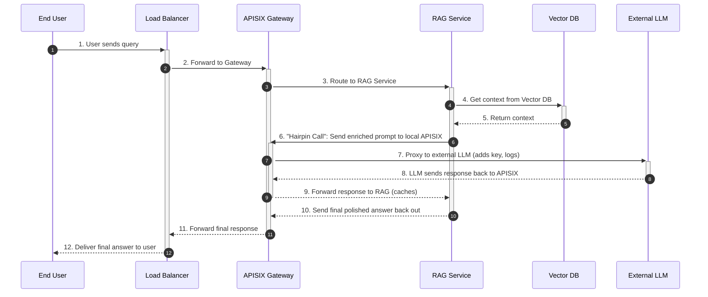
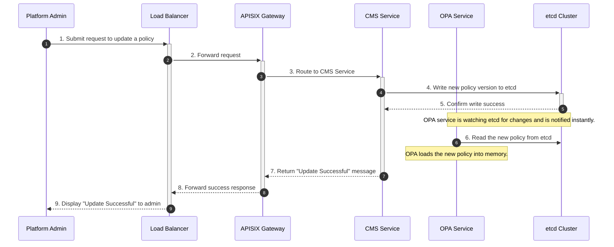

# System Workflows Explained (Corrected)

This document provides explicit, step-by-step diagrams for the key data flows within the CMS and RAG platform architecture. This version uses a simplified and validated diagram syntax to ensure it renders correctly.

## 1. End-to-End RAG Query Flow

This is the complete lifecycle of a query from a RAG platform user.

### RAG Query Sequence Diagram

### Step-by-Step Explanation

1.  **User Sends Query:** The end-user sends a request from their browser.
2.  **Forward to Gateway:** The Load Balancer forwards the request to a healthy Application Node.
3.  **Route to RAG Service:** The APISIX Gateway on the App Node routes the request to the RAG Application Service.
4.  **Get Context:** The RAG service queries the Vector Database to find relevant documents.
5.  **Return Context:** The Vector DB returns the relevant text snippets.
6.  **Hairpin Call:** The RAG service sends its enriched prompt to its **local APISIX Gateway**.
7.  **Proxy to LLM:** APISIX's AI Gateway plugins process the request, add API keys, and securely proxy it to the external LLM.
8.  **LLM Responds:** The LLM generates a response and sends it back to APISIX.
9.  **Forward to RAG:** APISIX receives the LLM's response, logs usage, and forwards it back to the RAG service.
10. **Send Final Answer:** The RAG service polishes the final answer and sends it back out through the established connection.
11. **Forward Final Response:** The response travels back through APISIX and the Load Balancer.
12. **Deliver to User:** The final, complete answer is delivered to the user's browser.

---

## 2. CMS Policy Update Flow

This diagram shows how a Platform Admin updates a policy in the system.

### Policy Update Sequence Diagram

