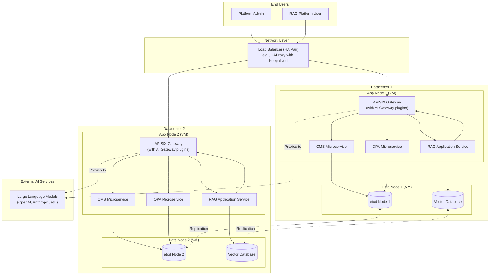
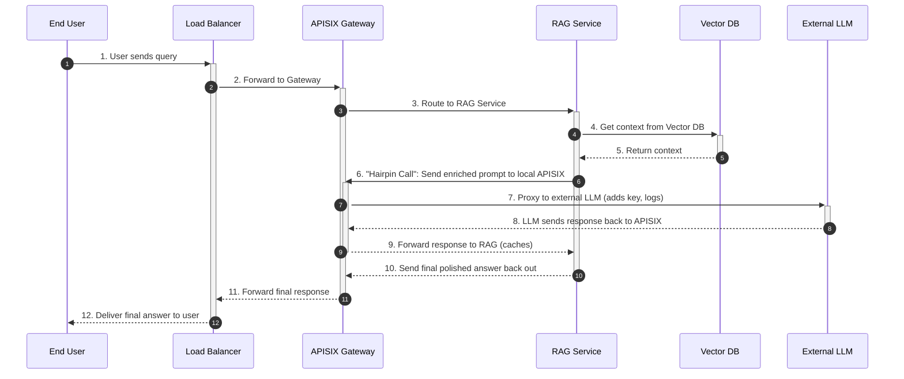
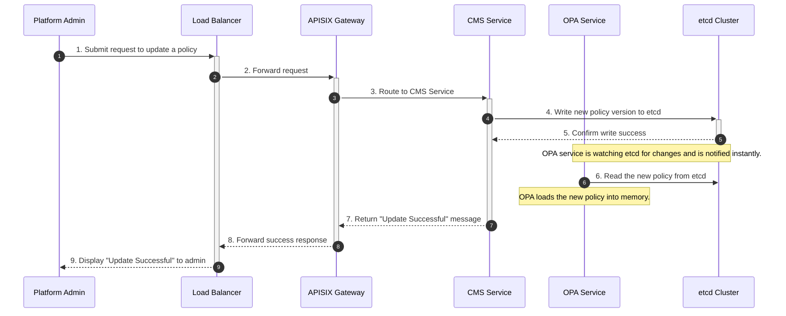

# Complete System Architecture and Workflows

This document provides a single, comprehensive view of the entire system, from the high-level component architecture to the detailed, step-by-step sequence of operations.

## 1. Integrated Architecture Diagram

This diagram shows the complete system, including the CMS and RAG Platform services, and illustrates the physical deployment across datacenters and VMs.

## 2. Component Descriptions

-   **RAG Application Service:** The backend for your RAG platform. It handles user queries, retrieves documents from the Vector DB, and orchestrates calls to the LLM.
-   **Vector Database:** A specialized database (e.g., Milvus, Weaviate) that stores document embeddings for fast similarity searches. It is a stateful service and resides on the **Data Nodes**.
-   **Large Language Models (LLMs):** External, third-party AI services that your platform will call via the APISIX gateway.

## 3. LLM Request Flow Explained

The flow for handling LLM requests is a critical pattern called a **"hairpin" or "reflexive" proxy**.

1.  A user's request arrives at the **RAG Application Service**.
2.  The RAG service queries the **Vector Database** to get relevant context.
3.  Crucially, instead of calling the external LLM directly, the RAG service makes a request back to its **local APISIX Gateway** (e.g., at `http://localhost:9080/llm/openai/...`).
4.  **APISIX's AI Gateway plugins** intercept this request to:
    *   Securely inject the required LLM API key.
    *   Enforce rate limits and budget controls.
    *   Log requests and token usage for observability.
    *   Potentially serve a response from its cache.
5.  APISIX then proxies the authenticated request to the actual **external LLM provider**.
6.  The response flows back through APISIX (where it can be logged and cached) to the RAG service, which then prepares the final, polished answer for the user.

This pattern provides centralized security, control, and cost management for all AI traffic.

---

## 4. Detailed Workflow Sequence Diagrams

### End-to-End RAG Query Flow

### CMS Policy Update Flow

