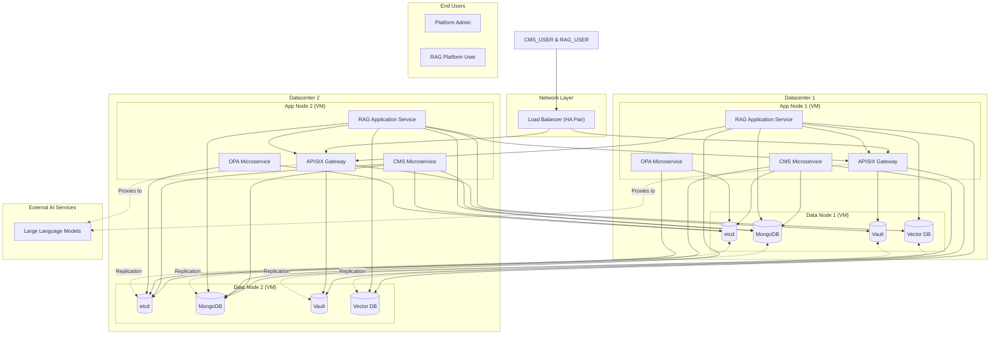
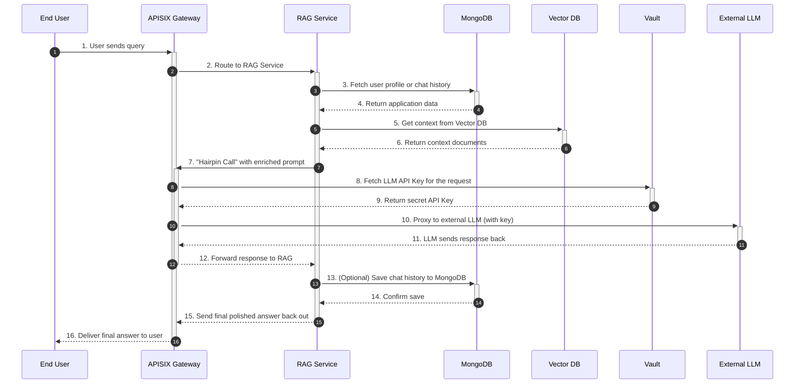
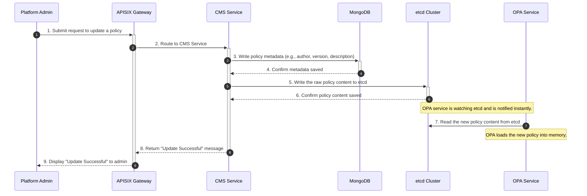

# Complete Architecture with MongoDB and Vault

This document provides a comprehensive view of the system architecture, incorporating MongoDB for general application data and HashiCorp Vault for secrets management.

## 1. Integrated Architecture Diagram

This diagram shows the complete system with the clear separation of data stores based on their function.

## 2. Component Descriptions

-   **etcd:** A distributed key-value store used exclusively for **live configuration data** and **OPA policies**. Its `watch` feature allows for instant propagation of policy changes.
-   **MongoDB:** A general-purpose document database used for all other **application data**. This includes user profiles, document metadata, chat histories, and policy metadata (like version history and author).
-   **HashiCorp Vault:** A dedicated **secrets management** tool. It securely stores, controls, and audits access to all secrets, including API keys for LLMs and credentials for the databases.
-   **Vector Database:** A specialized database for storing and querying vector embeddings for the RAG platform.

---

## 3. Detailed Workflow Sequence Diagrams

### End-to-End RAG Query Flow (with Vault and MongoDB)

### CMS Policy Update Flow (with MongoDB and etcd)

