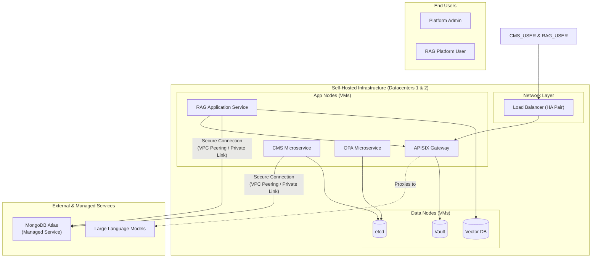
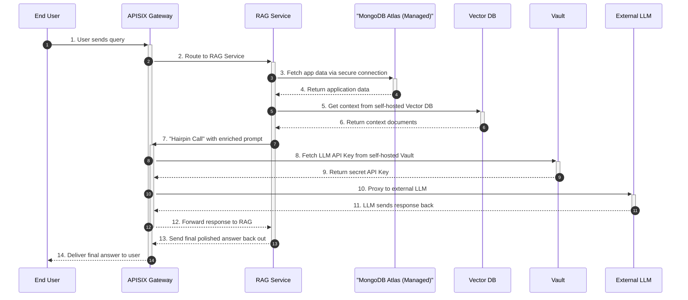
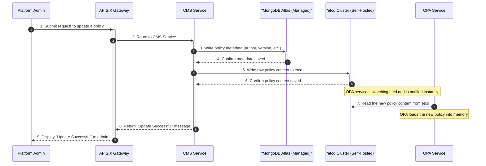

# Architecture with a Managed MongoDB Service

This document provides a comprehensive view of the system architecture, updated to reflect the use of a managed MongoDB service (e.g., MongoDB Atlas). This is a common and highly recommended pattern for production systems.

## 1. Architecture with Managed Database

This diagram visually separates the self-hosted infrastructure from external managed services, providing a clear architectural boundary.

## 2. Rationale for Using a Managed Database

Using a managed service for MongoDB is a strategic decision that offers significant advantages:
-   **Reduced Operational Overhead:** Your team is freed from the responsibility of database installation, patching, backups, replication, and scaling.
-   **Enhanced Reliability:** Managed services typically come with a high uptime Service Level Agreement (SLA), often higher than what can be achieved in-house without a dedicated database team.
-   **Simplified Internal Infrastructure:** Your on-premise Data Nodes become leaner, more focused, and easier to manage.
-   **Focus on Core Business:** It allows your development team to focus on building features for your RAG platform, not on becoming expert database administrators.

---

## 3. Detailed Workflow Sequence Diagrams

### End-to-End RAG Query Flow (with Managed MongoDB)

This diagram shows the RAG service communicating with the managed MongoDB endpoint over a secure connection.

### CMS Policy Update Flow (with Managed MongoDB)

This diagram illustrates the separation of concerns: the raw policy goes to the self-hosted `etcd` for instant watching, while the policy's metadata goes to the managed MongoDB for long-term storage and querying.

