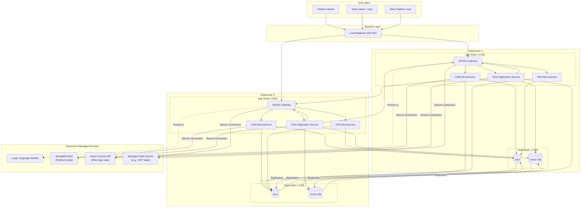
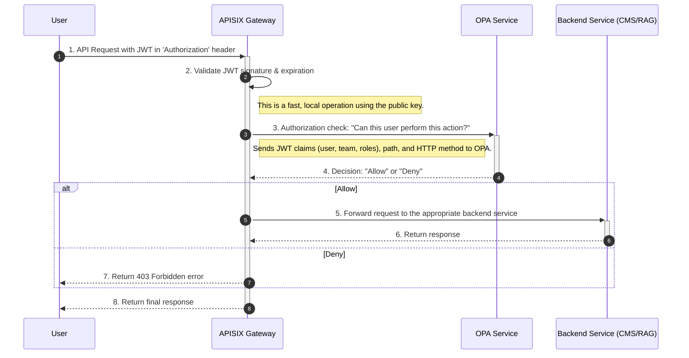
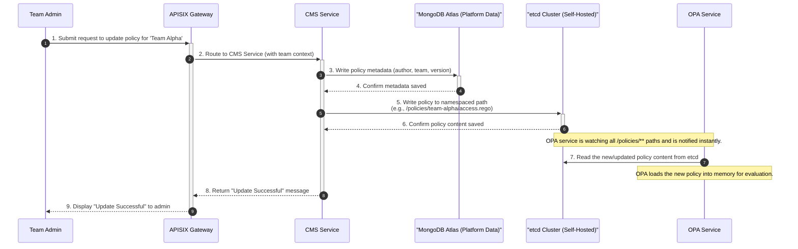
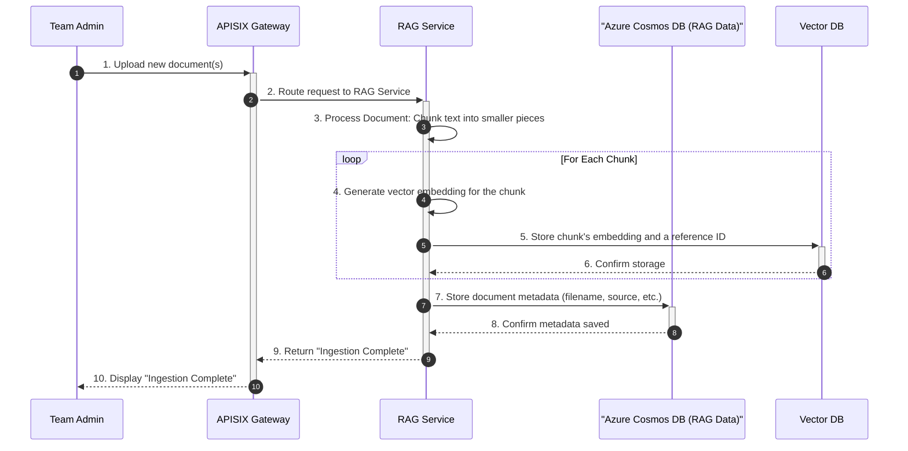
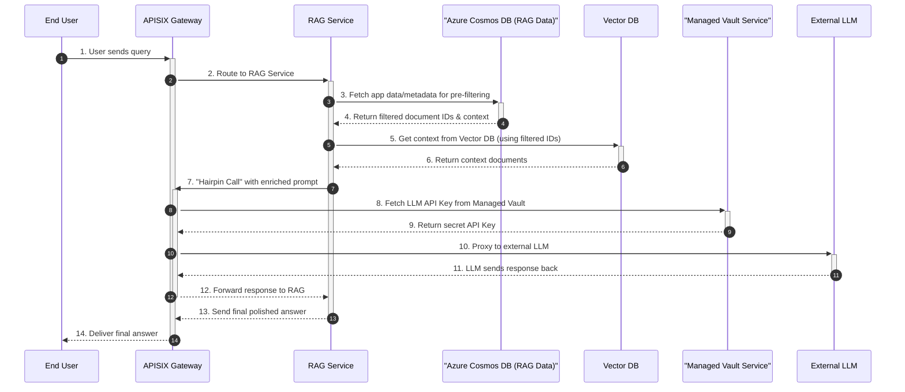

# Definitive Platform Architecture & Core Workflows

## Overview

This document provides the definitive, comprehensive guide to the Configuration Management System (CMS) and its surrounding RAG (Retrieval-Augmented Generation) platform architecture. It is designed to be a single source of truth for engineering teams, detailing not only the components and their connections but also the strategic rationale behind key design decisions.

The primary goals of this architecture are:
- **High Availability:** Ensure system resilience and uptime through a dual-datacenter deployment and use of managed services.
- **Scalability:** Allow individual components to scale independently to meet demand.
- **Security:** Enforce a robust, centralized security model for all operations, leveraging a managed secrets platform.
- **Multi-Tenancy:** Enable different teams to use the platform securely and in isolation.
- **Extensibility:** Provide a flexible foundation for adding new features and services.

---

## 1. High-Availability Architecture Diagram

This diagram illustrates the complete, production-grade architecture. It shows the physical deployment across two datacenters and the clear separation between self-hosted services and fully managed cloud services, including the managed Vault service.

---

## 2. Component Descriptions & Rationale

This section details each component's role and the reasoning behind its inclusion in the architecture.

#### Network & Gateway
-   **Load Balancer (HA Pair):** The single entry point to the system. Deployed as an Active-Passive High-Availability pair to prevent it from being a single point of failure. It distributes traffic across the APISIX gateways in both datacenters.
-   **APISIX Gateway:** The core of the request management and security enforcement layer. Its responsibilities include routing, security enforcement (JWT validation, OPA delegation), and acting as a centralized "hairpin" proxy for all outbound LLM traffic.

#### Core Platform Services
-   **CMS Microservice:** The "control plane" for managing policies. It provides APIs for teams to manage their Rego policies, writing metadata to MongoDB and raw policy content to `etcd`.
-   **OPA Microservice (Open Policy Agent):** The stateless "decision engine" for authorization. It loads all policies from `etcd` into memory and uses its `watch` feature to receive instant updates, providing "Allow" or "Deny" decisions to APISIX.

#### RAG Application
-   **RAG Application Service:** Contains the business logic for the RAG functionality, handling document ingestion, pre-filtering, context enrichment, and communication with the LLM.

#### Self-Hosted Data Stores
-   **etcd:** A consistent key-value store used exclusively for **live, watchable configuration data**, primarily OPA policies. Its `watch` capability is critical for near real-time policy propagation.
-   **Vector DB (e.g., Milvus, Weaviate):** A specialized database for efficient similarity searching on vector embeddings. It stores the vectorized chunks of ingested documents.

#### Managed Services
-   **Managed Vault Service (e.g., HCP Vault):** A dedicated, centralized secrets management service provided by a cloud vendor. This is a critical strategic choice to **offload the significant operational burden** of managing, securing, and maintaining a highly available Vault cluster. It stores all sensitive data, including database credentials and API keys. Services authenticate to the managed service endpoint to retrieve secrets at runtime.
-   **MongoDB Atlas (Platform Data):** A managed NoSQL database used by the **core platform services** (CMS, APISIX) for data that does not need to be "watched," such as policy metadata, user roles, and gateway plugin configurations.
-   **Azure Cosmos DB (RAG App Data):** A managed NoSQL database used exclusively by the **RAG Application Service**. This clear separation of concerns allows the RAG team to manage their own data schema for document metadata, pre-filtering attributes, and user chat history.
-   **Large Language Models (LLM):** External, third-party AI services that provide the generative capabilities for the RAG system.

---

## 3. Scalability and High Availability

-   **High Availability:** The architecture achieves HA through a multi-layered strategy:
    -   **Managed Services:** The availability and disaster recovery of Vault, MongoDB, and Cosmos DB are handled by their respective cloud providers.
    -   **Self-Hosted Replication:** The stateful components that we manage (`etcd`, `Vector DB`) have their data replicated across both datacenters.
    -   **Stateless Services:** The "App Nodes" are stateless, allowing the Load Balancer to redirect traffic to the healthy datacenter in a disaster scenario.
-   **Scalability:** The stateless "App Nodes" allow for horizontal scaling. If any service comes under heavy load, new App Node VMs can be provisioned and added to the Load Balancer's pool to increase capacity.

---

## 4. Multi-Tenant Policy Model

The system uses a hybrid policy model to provide both centralized control and delegated flexibility.

-   **Platform-Level Policies:** Managed by Platform Admins. These are global rules that apply to all teams and cannot be overridden. They enforce universal security and operational guardrails.
-   **Team-Level Policies:** Managed by individual teams via the CMS API. These define business logic and access control specific to that team's resources.

During an authorization check, OPA evaluates the request by combining the global platform policies with the specific policies of the team making the request, ensuring both sets of rules are satisfied.

---

## 5. Core Workflow Sequence Diagrams

This section details the key operational flows within the platform.

### 5.1 Authorization Flow (JWT Validation)
This workflow shows how every incoming API request is authorized. It assumes the user has already authenticated with a separate identity provider and possesses a valid JWT.

### 5.2 CMS Team-Specific Policy Update Flow
This flow shows how a Team Admin updates a policy for their specific team, correctly using MongoDB for platform metadata.

### 5.3 RAG Document Ingestion Flow
This high-level workflow shows how new documents are added to the RAG platform, correctly using Cosmos DB for RAG-specific metadata.

### 5.4 RAG Data Retrieval Flow
This flow details how a user query is answered, correctly showing the interaction with the **Managed Vault Service**.

